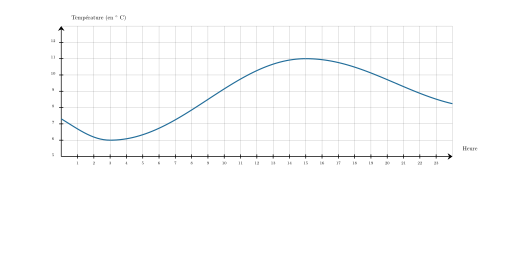
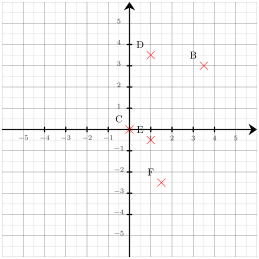




---Q---
Calculer le carré de $6$
---CORR---
$6^2={\color{#8B3C52}\boldsymbol{36}}$


---Q---
On a représenté ci-dessous l'évolution de la température sur une journée.      
            À l'aide de ce graphique, répondre aux questions suivantes :

 
$\mathbf{a)}$ Quelle est la température la plus froide de la journée ? 

 
  $\mathbf{b)}$ Quelle est la température la plus chaude de la journée ? 

 
  $\mathbf{c)}$ À quelle heure fait-il le plus chaud ? 

 
  $\mathbf{d)}$ À quelle heure fait-il le plus froid ? 
---CORR---
<strong>a.</strong>  La température la plus basse est ${\color{#8B3C52}\boldsymbol{6^\circ\mathbf{C}}}$. 
            <strong>b.</strong>  La température la plus élevée est ${\color{#8B3C52}\boldsymbol{11^\circ\mathbf{C}}}$. 
            <strong>c.</strong>  Il fait le plus chaud à  ${\color{#8B3C52}\boldsymbol{15\mathbf{h}}}$. 
            <strong>d.</strong>  Il fait le plus froid à ${\color{#8B3C52}\boldsymbol{3\mathbf{h}}}$.


---Q---
Compléter. $4\,\text{m}^3=\ldots\,\text{L}$
---CORR---
$4\,\text{m}^3=4\times1\,000\,\text{dm}^3={\color{#8B3C52}\boldsymbol{4\,000\,\mathbf{L}}}$


---Q---
On choisit au hasard un élève dans un groupe composé de $6$ filles et $18$ garçons. Quelle est la probabilité de choisir une fille ?
---CORR---
Il y a en tout : $6 + 18 = 24$ élèves. La probabilité de choisir une fille est de ${\color{#8B3C52}\boldsymbol{\dfrac{6}{24}}}$, soit ${\color{#8B3C52}\boldsymbol{\dfrac{1}{4}}}$.






---Q---
Calculer $\dfrac{1}{5} \text{ de } 200 \text{ L}$.
---CORR---
$\dfrac{1}{5}$ de $200$ L = ${\color{#8B3C52}\boldsymbol{40}}$ L 
      Mentalement :  
    Prendre $\dfrac{1}{5}$ d'une quantité revient à la diviser par $5$. 
    Ainsi, $\dfrac{1}{5}$ de $200=200\div 5=40$.


---Q---
Réduire cette expression, si cela est possible : $C=5x-4$
---CORR---
$C = {\color{#8B3C52}\boldsymbol{5x-4}}$ 


---Q---
Déterminer les coordonnées respectives des points $C$, $B$, $F$, $D$ et $E$ 
---CORR---
Les coordonnées respectives des points sont :  $C({\color{#8B3C52}\boldsymbol{0}};{\color{#8B3C52}\boldsymbol{0}})$, $B({\color{#8B3C52}\boldsymbol{3{,}5}};{\color{#8B3C52}\boldsymbol{3}})$, $F({\color{#8B3C52}\boldsymbol{1{,}5}};{\color{#8B3C52}\boldsymbol{-2{,}5}})$, $D({\color{#8B3C52}\boldsymbol{1}};{\color{#8B3C52}\boldsymbol{3{,}5}})$ et $E({\color{#8B3C52}\boldsymbol{1}};{\color{#8B3C52}\boldsymbol{-0{,}5}})$


---Q---
Les notes obtenues par un élève sont : $7 ; 19{,}5 ; 20 ; 12{,}5 ; 5{,}5$. 
    Que vaut la médiane de cette série de notes ?
---CORR---
Rangeons les notes dans l'ordre croissant : $5{,}5 ; 7 ; 12{,}5 ; 19{,}5 ; 20$. 
    Comme il y a 5 notes (nombre impair), la médiane est la note du milieu, c'est-à-dire la 3e note : ${\color{#8B3C52}\boldsymbol{12{,}5}}$.






---Q---
Calculer. $ (-63)  \div (-9)$
---CORR---
$ {\color{#A4485F}\boldsymbol{(-63)}}  \div {\color{#A4485F}\boldsymbol{(-9)}} = {\color{#8B3C52}\boldsymbol{(+7)}}$


---Q---
Résoudre l'équation suivante : $y+13=8$
---CORR---
$y+13=8$ $y+13{\color{blue}\boldsymbol{\,\,-\,\,13}}=8{\color{blue}\boldsymbol{\,\,-\,\,13}}$ $y=-5$  La solution de l'équation $y+13=8$ est ${\color{#8B3C52}\boldsymbol{-5}}$.


---Q---
Dans le triangle $ABC$ rectangle en $B$, on sait que $\widehat{A} = 14^\circ$.  
      Calculer $\widehat{C}$. 
---CORR---
On sait que la somme des angles d'un triangle est égale à $180^\circ$.  
    Donc, dans le triangle $ABC$, on a :  
    $\widehat{A} + \widehat{B} + \widehat{C} = 180^\circ$.  
    Or, comme le triangle est rectangle en $B$, on a $\widehat{B} = 90^\circ$.  
    Donc, $14^\circ + 90^\circ + \widehat{C} = 180^\circ$.  
    D'où $\widehat{C} = 180^\circ - 90^\circ - 14^\circ = 90^\circ - 14^\circ = {\color{#8B3C52}\boldsymbol{76}}^\circ$.


---Q---
Une élève souhaite réaliser un programme pour dessiner un octogone régulier.  
    Par quelles valeurs doit-elle compléter les lignes 3 et 5 ? 
---CORR---
Pour obtenir un octogone régulier, il faut répéter ${\color{#8B3C52}\mathbf{8}}$ fois  
    et tourner de $\dfrac{360}{8} = {\color{#8B3C52}\mathbf{45}}$ degrés.



