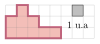



1
---Q---
Donner le nom de ce solide.
 

---CORR---
Prisme droit avec une base ayant $6$ sommets.


2
---Q---
On donne la série statistique suivante : $10$ ; $12$ ; $14$ ; $15$ ; $10$. Quelle valeur faut-il ajouter à la série pour que sa moyenne soit égale à $11$ ?  A. $6$ &emsp; B. $3$ &emsp; C. $7$ &emsp; D. $5$

---CORR---
Appelons $x$ la valeur cherchée. La somme des valeurs : $10 + 12 + 14 + 15 + 10 = 61$. La nouvelle série contient $6$ valeurs, sa moyenne vaut : $\dfrac{61 + x}{6} = 11$. $61 + x = 66$, donc $x = 11 \times 6 - 61 = {\color{#EB7F73}\boldsymbol{5}}$. La bonne réponse est la réponse D.


3
---Q---
$800~\text{cm}^2 = \ldots~\text{m}^2$
---CORR---
$800~\text{cm}^2 = 800\div100\div100~\text{m}^2 = {\color{#EB7F73}\boldsymbol{0{,}08}}~\text{m}^2$


4
---Q---
Calculer : $A = 1 \div \dfrac{4}{9}$

---CORR---
$A = 1 \div \dfrac{4}{9} = 1 \times \dfrac{9}{4} = {\color{#EB7F73}\boldsymbol{\dfrac{9}{4}}}$


5
---Q---
Estimer la mesure de l'angle $\widehat{tGs}$ sans instrument.  A. $90^\circ$ &emsp; B. $180^\circ$ &emsp; C. $113^\circ$ &emsp; D. $158^\circ$ &emsp; E. $68^\circ$
 

---CORR---
L'angle $\widehat{tGs}$ mesure ${\color{#EB7F73}\boldsymbol{113^\circ}}$. Réponse C.







1
---Q---
$FGH$ est un triangle rectangle en $F$ dans lequel $FG=6$ et $FH=\sqrt{2}$. Calculer la valeur exacte de $GH$.
---CORR---
On utilise le théorème de Pythagore dans le triangle $FGH$, rectangle en $F$. $FG^2+FH^2=GH^2$ $GH^2=(\sqrt{2})^2+6^2=2+36=38$ $GH={\color{#EB7F73}\boldsymbol{\sqrt{38}}}$ Mentalement : n'oubliez pas que $(\sqrt{2})^2=2$. La valeur cherchée est donc : $\sqrt{38}$.


2
---Q---
$10$ ; $5$ ; $5$ ; $1$ ; $24$ La moyenne de cette série est :  A. $9$ &emsp; B. $9{,}5$ &emsp; C. $10$ &emsp; D. $9{,}2$
---CORR---
La somme des $5$ valeurs est : $10+5+5+1+24= 45$. La moyenne est donc $\dfrac{45}{5}={\color{#EB7F73}\boldsymbol{9}}$. La bonne réponse est la réponse A.


3
---Q---
Calculer l'aire exacte d'un disque de rayon $4~\text{cm}$.
---CORR---
$\mathcal{A}_\text{disque} = r \times r \times \pi = 4~\text{cm} \times 4~\text{cm} \times \pi = {\color{#EB7F73}\boldsymbol{16\pi}}~\text{cm}^2$


4
---Q---
Combien valent les deux quarts de $12$ ?
---CORR---
Un quart de $12$ est égal à $12 \div 4$, soit $3$. Donc les deux quarts de $12$ valent $2 \times 3 = {\color{#EB7F73}\boldsymbol{6}}$.


5
---Q---
Dans le triangle $ABC$ rectangle en $B$, on sait que $\widehat{A} = 36^\circ$. Calculer $\widehat{C}$.
 

---CORR---
Dans le triangle $ABC$, on a : $\widehat{A} + \widehat{B} + \widehat{C} = 180^\circ$. Comme le triangle est rectangle en $B$, $\widehat{B} = 90^\circ$. Donc $36^\circ + 90^\circ + \widehat{C} = 180^\circ$. D'où $\widehat{C} = 180^\circ - 90^\circ - 36^\circ = {\color{#EB7F73}\boldsymbol{54}}^\circ$.






1
---Q---
Gabrielle achète dans la boutique du musée des livres. Elle repart avec 5 livres pour $15$€. Zacharie achète quant à lui, au même endroit 15 livres pour $45$€. Le prix des livres est-il proportionnel à la quantité achetée ?
---CORR---
Gabrielle dépense ${\color{#C5607A}\boldsymbol{15}}$€. Zacharie a acheté ${\color{#EB7F73}\boldsymbol{3}}$ fois la quantité des livres achetée par Gabrielle pour ${\color{#C5607A}\boldsymbol{15}}$€. Il a payé $45$€ $={\color{#EB7F73}\boldsymbol{3}}\times{\color{#C5607A}\boldsymbol{15}}$€. À l'aide de ces données, on constate que le prix des livres et leur quantité sont tous les deux multipliés par le même nombre, donc ces deux grandeurs sont proportionnelles.


2
---Q---
Quelle est l'aire de la figure ?
 

---CORR---
L'aire de cette figure est : ${\color{#EB7F73}\boldsymbol{9}}$ u.a.


3
---Q---
Calculer : $-3 - (-6)$
---CORR---
$-3 - (-6) = {\color{#EB7F73}\boldsymbol{3}}$


4
---Q---
Qu'est-ce qui caractérise les angles rose et violet ?
 

---CORR---
Ce sont des angles correspondants.


5
---Q---
On a réalisé $500$ lancers de $2$ dés à $10$ faces. Calculer la fréquence de la valeur $2$.
<table style="border-collapse:collapse;margin:0.8rem auto;font-size:0.85rem">
<tr><th style="background:#FDF2F4;color:#8B3C52;border:1px solid #ddb8c0;padding:5px 8px;font-weight:600">Scores</th><td style="border:1px solid #ddb8c0;padding:5px 8px;text-align:center;color:#2D2226">$2$</td><td style="border:1px solid #ddb8c0;padding:5px 8px;text-align:center;color:#2D2226">$3$</td><td style="border:1px solid #ddb8c0;padding:5px 8px;text-align:center;color:#2D2226">$4$</td><td style="border:1px solid #ddb8c0;padding:5px 8px;text-align:center;color:#2D2226">$5$</td><td style="border:1px solid #ddb8c0;padding:5px 8px;text-align:center;color:#2D2226">$6$</td><td style="border:1px solid #ddb8c0;padding:5px 8px;text-align:center;color:#2D2226">$7$</td><td style="border:1px solid #ddb8c0;padding:5px 8px;text-align:center;color:#2D2226">$8$</td><td style="border:1px solid #ddb8c0;padding:5px 8px;text-align:center;color:#2D2226">$9$</td><td style="border:1px solid #ddb8c0;padding:5px 8px;text-align:center;color:#2D2226">$10$</td><td style="border:1px solid #ddb8c0;padding:5px 8px;text-align:center;color:#2D2226">$11$</td></tr>
<tr><th style="background:#FDF2F4;color:#8B3C52;border:1px solid #ddb8c0;padding:5px 8px;font-weight:600">Apparitions</th><td style="border:1px solid #ddb8c0;padding:5px 8px;text-align:center;color:#2D2226">$3$</td><td style="border:1px solid #ddb8c0;padding:5px 8px;text-align:center;color:#2D2226">$8$</td><td style="border:1px solid #ddb8c0;padding:5px 8px;text-align:center;color:#2D2226">$15$</td><td style="border:1px solid #ddb8c0;padding:5px 8px;text-align:center;color:#2D2226">$21$</td><td style="border:1px solid #ddb8c0;padding:5px 8px;text-align:center;color:#2D2226">$31$</td><td style="border:1px solid #ddb8c0;padding:5px 8px;text-align:center;color:#2D2226">$28$</td><td style="border:1px solid #ddb8c0;padding:5px 8px;text-align:center;color:#2D2226">$38$</td><td style="border:1px solid #ddb8c0;padding:5px 8px;text-align:center;color:#2D2226">$39$</td><td style="border:1px solid #ddb8c0;padding:5px 8px;text-align:center;color:#2D2226">$31$</td><td style="border:1px solid #ddb8c0;padding:5px 8px;text-align:center;color:#2D2226">$53$</td></tr>
</table>
<table style="border-collapse:collapse;margin:0.3rem auto;font-size:0.85rem">
<tr><th style="background:#FDF2F4;color:#8B3C52;border:1px solid #ddb8c0;padding:5px 8px;font-weight:600">Scores</th><td style="border:1px solid #ddb8c0;padding:5px 8px;text-align:center;color:#2D2226">$12$</td><td style="border:1px solid #ddb8c0;padding:5px 8px;text-align:center;color:#2D2226">$13$</td><td style="border:1px solid #ddb8c0;padding:5px 8px;text-align:center;color:#2D2226">$14$</td><td style="border:1px solid #ddb8c0;padding:5px 8px;text-align:center;color:#2D2226">$15$</td><td style="border:1px solid #ddb8c0;padding:5px 8px;text-align:center;color:#2D2226">$16$</td><td style="border:1px solid #ddb8c0;padding:5px 8px;text-align:center;color:#2D2226">$17$</td><td style="border:1px solid #ddb8c0;padding:5px 8px;text-align:center;color:#2D2226">$18$</td><td style="border:1px solid #ddb8c0;padding:5px 8px;text-align:center;color:#2D2226">$19$</td><td style="border:1px solid #ddb8c0;padding:5px 8px;text-align:center;color:#2D2226">$20$</td></tr>
<tr><th style="background:#FDF2F4;color:#8B3C52;border:1px solid #ddb8c0;padding:5px 8px;font-weight:600">Apparitions</th><td style="border:1px solid #ddb8c0;padding:5px 8px;text-align:center;color:#2D2226">$41$</td><td style="border:1px solid #ddb8c0;padding:5px 8px;text-align:center;color:#2D2226">$48$</td><td style="border:1px solid #ddb8c0;padding:5px 8px;text-align:center;color:#2D2226">$34$</td><td style="border:1px solid #ddb8c0;padding:5px 8px;text-align:center;color:#2D2226">$35$</td><td style="border:1px solid #ddb8c0;padding:5px 8px;text-align:center;color:#2D2226">$23$</td><td style="border:1px solid #ddb8c0;padding:5px 8px;text-align:center;color:#2D2226">$19$</td><td style="border:1px solid #ddb8c0;padding:5px 8px;text-align:center;color:#2D2226">$16$</td><td style="border:1px solid #ddb8c0;padding:5px 8px;text-align:center;color:#2D2226">$14$</td><td style="border:1px solid #ddb8c0;padding:5px 8px;text-align:center;color:#2D2226">$3$</td></tr>
</table>
---CORR---
La valeur $2$ apparaît $3$ fois. Le nombre total de lancers est $500$. La fréquence de la valeur $2$ est ${\color{#EB7F73}\boldsymbol{\dfrac{3}{500}}}={\color{#EB7F73}\boldsymbol{0{,}006}}$, soit $0{,}6~\%$.



