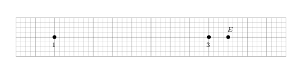
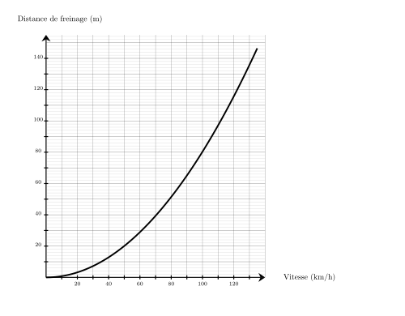
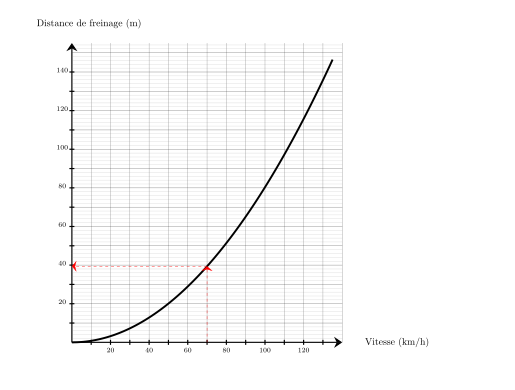




---Q---
En 12 ans, la population d'une ville est passée de $270\,000$ habitants à $221\,400$. Exprimer cette diminution en pourcentage.
---CORR---
$221\,400\div 270\,000 = 0{,}82 =  82\,\% = 100\,\%-18\,\%$ La population a été multipliée par $0{,}82$ elle a donc diminué de ${\color{#8B3C52}\boldsymbol{18}}\,\%$.


---Q---
Sur chaque droite graduée, déterminer l’abscisse du point $E$.  <strong>A</strong>. $\dfrac{29}{8}$ &emsp;
    <strong>B</strong>. $3$ &emsp;
    <strong>C</strong>. $\dfrac{13}{4}$ &emsp;
    <strong>D</strong>. $\dfrac{25}{8}$ 
---CORR---
On remarque qu'il y a 8 divisions entre $1$ et $3$, donc chaque division vaut $\dfrac{1}{4}$. 
    Le point $E$ est situé après $13$ divisions à partir de l'origine. 
    Donc l'abscisse de $E$ est $\dfrac{13}{4}$. 
    Bonne réponse : C.


---Q---
Calculer l'aire d'un disque de diamètre $10\text{ cm}$
---CORR---
$\mathcal{A}_\text{disque} = r \times r \times \pi$ $\mathcal{A}_\text{disque} = 5\text{ cm} \times 5\text{ cm} \times \pi$ $\mathcal{A}_\text{disque} = {\color{#8B3C52}\boldsymbol{25\pi}}\text{ cm}^2$


---Q---
Déterminer la valeur exacte de $FG$. 
---CORR---
On utilise le théorème de Pythagore dans le triangle $EFG$,  rectangle en $F$. 
      On obtient :

 

$\begin{aligned}
        EF^2+FG^2&=EG^2\\
        FG^2&=EG^2-EF^2\\
        FG^2&=6^2-3^2\\
        FG^2&=36-9\\
        FG^2&=27\\
        FG&={\color{#8B3C52}\boldsymbol{\sqrt{27}}}
        \end{aligned}$






---Q---
Donner l'écriture scientifique de $100$
---CORR---
$100 = {\color{#8B3C52}\boldsymbol{1\times 10^{2}}}$


---Q---
Teresa doit acheter du gazon.  Sur la notice, il est indiqué de prévoir $10$ kg pour $50\text{ m}^2$.   Combien doit-elle en acheter pour une surface de $250\text{ m}^2$ ?
---CORR---
Commençons par trouver combien de kg il faut prévoir pour $1\text{ m}^2$.  
 $1\text{ m}^2$, c'est ${\color{#C5607A}\boldsymbol{50}}$ fois moins que 50$\text{ m}^2$. $10$ kg $\div {\color{#C5607A}\boldsymbol{50}} = 0{,}2$ kg   on a donc besoin de ${\color{#C5607A}\boldsymbol{0{,}2}}$ kg pour recouvrir $1\text{ m}^2$.  Cherchons maintenant la quantité de kg nécessaire pour recouvrir $250\text{ m}^2$.  $250\text{ m}^2$, c'est ${\color{#C5607A}\boldsymbol{250}}$ fois plus que $1\text{ m}^2$.  ${\color{#C5607A}\boldsymbol{0{,}2}}$ kg $\times {\color{#C5607A}\boldsymbol{250}} = 50$ kg  Teresa aura besoin de ${\color{#8B3C52}\boldsymbol{50}}$ kg pour recouvrir $250\text{ m}^2$.


---Q---
Calculer le volume d'un prisme droit de hauteur $0{,}8\text{ m}$ et dont les bases sont des triangles de base $6\text{ dm}$ et de hauteur correspondante $36\text{ cm}$.
---CORR---
$\mathcal{V}=\mathcal{B} \times h=\dfrac{6\text{ dm}\times36\text{ cm}}{2}\times0{,}8\text{ m}=\dfrac{6\text{ dm}\times3{,}6\text{ dm}}{2}\times8\text{ dm}={\color{#8B3C52}\boldsymbol{86{,}4\mathbf{ dm}^3}}$


---Q---
Sur la figure suivante : 
          $\leadsto U$ est sur $[TR]$,
          $\leadsto V$ est sur $[TS]$,  $\leadsto$ les droites $(RS)$ et $(UV)$ sont parallèles. Écrire la double égalité de Thalès. 
---CORR---
Dans le triangle $RST$ :
         $\leadsto$ $U\in[TR]$,
         $\leadsto$ $V\in[TS]$,
         $\leadsto$  $(RS)//(UV)$,
         donc d'après le théorème de Thalès, les triangles $RST$ et $UVT$ ont des longueurs proportionnelles.

 
$\dfrac{TU}{TR}=\dfrac{TV}{TS}=\dfrac{UV}{RS}$ <strong>Remarque</strong> On pourrait aussi écrire : $\dfrac{TR}{TU}=\dfrac{TS}{TV}=\dfrac{RS}{UV}$






---Q---
Compléter le tableau en mettant oui ou non dans chaque case. $$\begin{array}{|l|c|c|c|c|}
    \hline
    \text{... est divisible} & \text{par }2 & \text{par }3 & \text{par }5 & \text{par }9\\
    \hline
    95 & & & & \\
    \hline
    \end{array}$$
---CORR---
$$\begin{array}{|l|c|c|c|c|}
    \hline
    \text{... est divisible} & \text{par }2 & \text{par }3 & \text{par }5 & \text{par }9\\
    \hline
    95 & \text{non} & \text{non} & \color{blue}{\text{oui}} & \text{non} \\
    \hline
    \end{array}$$


---Q---
Une voiture roule à la vitesse de $70\text{ km/h}$ sur une route sèche. 
    En utilisant le graphique ci-dessous, quelle est la distance de freinage en mètres ? 
---CORR---
Pour une vitesse de $70\text{ km/h}$, la distance de freinage est d'environ ${\color{#8B3C52}\boldsymbol{39}}\text{ m}$. 


---Q---
Compléter. $ 30\,\text{m}^2 = \ldots \,\text{dm}^2$
---CORR---
$ 30\,\text{m}^2 =  30\times100\,\text{dm}^2 = 3\,000\,\text{dm}^2$ $$\def\arraystretch{1.5}\begin{array}{|c|c|c|c|c|c|c|c|c|c|}\hline \hspace*{0.4cm}  &\text{km}^2  &\text{hm}^2  &\text{dam}^2  &\text{m}^2  &\text{dm}^2  &\text{cm}^2  &\text{mm}^2  &\hspace*{0.4cm}  \\\hline\begin{array}{c|c} &   \\  &   \\\end{array} & \begin{array}{c|c} &   \\  &   \\\end{array} & \begin{array}{c|c} &   \\  &   \\\end{array} & \begin{array}{c|c} &   \\  &   \\\end{array} & \begin{array}{c|c}3 & \color{red}{0}  \\ 3 & 0  \\\end{array} & \begin{array}{c|c} &   \\ 0 & \color{red}{0}  \\\end{array} & \begin{array}{c|c} &   \\  &   \\\end{array} & \begin{array}{c|c} &   \\  &   \\\end{array} & \begin{array}{c|c} &   \\  &   \\\end{array}\\ \hline  \end{array}$$


---Q---
Dans le triangle $LUZ$, rectangle en $U$, quel calcul doit-on effectuer pour déterminer le cosinus de l’angle $\widehat{ULZ}$ ? 
---CORR---
La bonne formule est :  
    $\text{cosinus}(\widehat{ULZ}) = \dfrac{\text{longueur du côté adjacent à l’angle } \widehat{ULZ}}{\text{longueur de l’hypoténuse }}=\dfrac{LU}{LZ}$.



