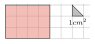
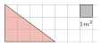



1
---Q---
Isabelle a repéré, à l'épicerie, des pots de cancoillotte qui l'intéressent. Elle lit que $9$ pots de cancoillotte coûtent $27$€. Elle veut en acheter $11$. Combien va-t-elle dépenser ?

---CORR---
$1$ pot de cancoillotte coûte $27\div 9 = {\color{#C5607A}\boldsymbol{3}}$€. $11$ pots de cancoillotte coûtent ${\color{#C5607A}\boldsymbol{11}} \times {\color{#C5607A}\boldsymbol{3}} = {\color{#EB7F73}\boldsymbol{33}}$€.



2
---Q---
Les notes obtenues par un élève sont : $19{,}5$ ; $7{,}5$ ; $16$ ; $7$ ; $3{,}5$. Que vaut la médiane de cette série de notes ?

---CORR---
Rangeons les notes dans l'ordre croissant : $3{,}5$ ; $7$ ; $7{,}5$ ; $16$ ; $19{,}5$. Comme il y a $5$ notes (nombre impair), la médiane est la note du milieu, c'est-à-dire la 3e note : ${\color{#EB7F73}\boldsymbol{7{,}5}}$.


3
---Q---
Quelle est l'aire de la figure ?
 

---CORR---
L'aire de cette figure est : $4\times3\times2 = {\color{#EB7F73}\boldsymbol{24}}~\text{cm}^2$.


4
---Q---
$39$ est-il un nombre premier ?

---CORR---
Comme $3 + 9 = 12$ est un multiple de $3$, donc $39$ aussi. $39$ admet au moins trois diviseurs : $1$, $3$ et lui-même. ${\color{#EB7F73}\boldsymbol{39}}$ n'est donc pas premier.


5
---Q---
Dans le triangle $XHU$, rectangle en $H$, quel calcul doit-on effectuer pour déterminer le cosinus de l'angle $\widehat{HXU}$ ?
 

---CORR---
La bonne formule est : $\text{cosinus}(\widehat{HXU}) = \dfrac{\text{longueur du côté adjacent à l'angle } \widehat{HXU}}{\text{longueur de l'hypoténuse}}={\color{#EB7F73}\boldsymbol{\dfrac{XH}{XU}}}$







1
---Q---
Voici deux séries de valeurs : série A : $17$ ; $5$ ; $12$ série B : $32{,}5$ ; $2$ ; $0{,}5$ Laquelle des ces 4 propositions est vraie ?  A. Les deux séries ont la même moyenne et la même médiane. B. Les deux séries ont la même médiane mais pas la même moyenne. C. Les deux séries n'ont ni la même moyenne, ni la même médiane. D. Les deux séries ont la même moyenne mais pas la même médiane.
---CORR---
Moyenne A : $\dfrac{5+12+17}{3}=\dfrac{34}{3}$ ; médiane A : $12$. Moyenne B : $\dfrac{0{,}5+2+32{,}5}{3}=\dfrac{35}{3}$ ; médiane B : $2$. Les deux séries n'ont ni la même moyenne, ni la même médiane. La bonne réponse est la réponse C.


2
---Q---
Lisa et Tania se partagent $36$ bonbons dans le ratio $4:2$. Combien de bonbons chaque enfant reçoit-il ?
---CORR---
Si les enfants se partageaient $4+2=6$ bonbons alors Lisa en aurait $4$ et Tania en aurait $2$. Mais il y a $36$ bonbons, soit ${\color{#EB7F73}\boldsymbol{6}}\times 6$ bonbons. Donc Lisa en aura ${\color{#EB7F73}\boldsymbol{6}}\times 4={\color{#EB7F73}\boldsymbol{24}}$ et Tania en aura ${\color{#EB7F73}\boldsymbol{6}}\times 2={\color{#EB7F73}\boldsymbol{12}}$.


3
---Q---
Calculer l'aire exacte d'un carré de côté $10~\text{cm}$.
---CORR---
$\mathcal{A}_\text{carré} = c \times c = 10~\text{cm} \times 10~\text{cm} = {\color{#EB7F73}\boldsymbol{100}}~\text{cm}^2$


4
---Q---
$5 \times 9 = 50 - \ldots$
---CORR---
$5 \times 9 = 50 - {\color{#EB7F73}\boldsymbol{5}}$


5
---Q---
Qu'est-ce qui caractérise les angles rose et violet ?
 

---CORR---
Ce sont des angles alternes-internes.






11
---Q---
Donner le nom de ce solide.
 

---CORR---
Pyramide avec une base ayant $4$ sommets.


22
---Q---
Quelle est l'aire de la figure ?
 

---CORR---
L'aire de cette figure est : $4\times3\div2 = {\color{#EB7F73}\boldsymbol{6}}~\text{m}^2$.


33
---Q---
Donner l'écriture décimale de $1{,}7 \times 10^{-2}$.
---CORR---
L'écriture décimale de $1{,}7 \times 10^{-2}$ est ${\color{#EB7F73}\boldsymbol{0{,}017}}$.


44
---Q---
Comment peut-on nommer l'angle violet ?
 

---CORR---
L'angle violet se nomme, au choix : ${\color{#EB7F73}\boldsymbol{\widehat{JAF}}}$, ${\color{#EB7F73}\boldsymbol{\widehat{FAJ}}}$, ${\color{#EB7F73}\boldsymbol{\widehat{JAH}}}$, ${\color{#EB7F73}\boldsymbol{\widehat{HAJ}}}$, ${\color{#EB7F73}\boldsymbol{\widehat{ZAF}}}$, ${\color{#EB7F73}\boldsymbol{\widehat{FAZ}}}$, ${\color{#EB7F73}\boldsymbol{\widehat{ZAH}}}$, ${\color{#EB7F73}\boldsymbol{\widehat{HAZ}}}$.


55
---Q---
Dans un parking de supermarché comptant $500$ voitures, on a noté leur couleur.
<table style="border-collapse:collapse;margin:0.8rem auto;font-size:0.9rem">
<tr><th style="background:#FDF2F4;color:#8B3C52;border:1px solid #ddb8c0;padding:6px 10px;font-weight:600">Couleurs</th><th style="background:#FDF2F4;color:#8B3C52;border:1px solid #ddb8c0;padding:6px 10px;font-weight:600">Blanc</th><th style="background:#FDF2F4;color:#8B3C52;border:1px solid #ddb8c0;padding:6px 10px;font-weight:600">Vert</th><th style="background:#FDF2F4;color:#8B3C52;border:1px solid #ddb8c0;padding:6px 10px;font-weight:600">Rouge</th><th style="background:#FDF2F4;color:#8B3C52;border:1px solid #ddb8c0;padding:6px 10px;font-weight:600">Bleu</th><th style="background:#FDF2F4;color:#8B3C52;border:1px solid #ddb8c0;padding:6px 10px;font-weight:600">Gris</th><th style="background:#FDF2F4;color:#8B3C52;border:1px solid #ddb8c0;padding:6px 10px;font-weight:600">Noir</th><th style="background:#FDF2F4;color:#8B3C52;border:1px solid #ddb8c0;padding:6px 10px;font-weight:600">TOTAL</th></tr>
<tr><th style="background:#FDF2F4;color:#8B3C52;border:1px solid #ddb8c0;padding:6px 10px;font-weight:600">Effectifs</th><td style="border:1px solid #ddb8c0;padding:6px 10px;text-align:center;color:#2D2226">$151$</td><td style="border:1px solid #ddb8c0;padding:6px 10px;color:#2D2226"></td><td style="border:1px solid #ddb8c0;padding:6px 10px;text-align:center;color:#2D2226">$15$</td><td style="border:1px solid #ddb8c0;padding:6px 10px;text-align:center;color:#2D2226">$34$</td><td style="border:1px solid #ddb8c0;padding:6px 10px;text-align:center;color:#2D2226">$158$</td><td style="border:1px solid #ddb8c0;padding:6px 10px;text-align:center;color:#2D2226">$85$</td><td style="border:1px solid #ddb8c0;padding:6px 10px;text-align:center;color:#2D2226">$500$</td></tr>
<tr><th style="background:#FDF2F4;color:#8B3C52;border:1px solid #ddb8c0;padding:6px 10px;font-weight:600">Fréquences</th><td style="border:1px solid #ddb8c0;padding:6px 10px;color:#2D2226"></td><td style="border:1px solid #ddb8c0;padding:6px 10px;color:#2D2226"></td><td style="border:1px solid #ddb8c0;padding:6px 10px;color:#2D2226"></td><td style="border:1px solid #ddb8c0;padding:6px 10px;color:#2D2226"></td><td style="border:1px solid #ddb8c0;padding:6px 10px;color:#2D2226"></td><td style="border:1px solid #ddb8c0;padding:6px 10px;color:#2D2226"></td><td style="border:1px solid #ddb8c0;padding:6px 10px;color:#2D2226"></td></tr>
</table>
a. Déterminer l'effectif manquant. b. Déterminer les fréquences pour chaque couleur (en pourcentage, arrondir au dixième si besoin).
---CORR---
a. $e_\text{Vert}=500-(151+15+34+158+85)=500-443={\color{#EB7F73}\boldsymbol{57}}$  b.
<table style="border-collapse:collapse;margin:0.8rem auto;font-size:0.85rem">
<tr><th style="background:#FDF2F4;color:#8B3C52;border:1px solid #ddb8c0;padding:5px 8px;font-weight:600">&nbsp;</th><th style="background:#FDF2F4;color:#8B3C52;border:1px solid #ddb8c0;padding:5px 8px;font-weight:600">Blanc</th><th style="background:#FDF2F4;color:#8B3C52;border:1px solid #ddb8c0;padding:5px 8px;font-weight:600">Vert</th><th style="background:#FDF2F4;color:#8B3C52;border:1px solid #ddb8c0;padding:5px 8px;font-weight:600">Rouge</th><th style="background:#FDF2F4;color:#8B3C52;border:1px solid #ddb8c0;padding:5px 8px;font-weight:600">Bleu</th><th style="background:#FDF2F4;color:#8B3C52;border:1px solid #ddb8c0;padding:5px 8px;font-weight:600">Gris</th><th style="background:#FDF2F4;color:#8B3C52;border:1px solid #ddb8c0;padding:5px 8px;font-weight:600">Noir</th></tr>
<tr><th style="background:#FDF2F4;color:#8B3C52;border:1px solid #ddb8c0;padding:5px 8px;font-weight:600">Fréq. en %</th><td style="border:1px solid #ddb8c0;padding:5px 8px;text-align:center;color:#2D2226">${\color{#EB7F73}\boldsymbol{30{,}2~\%}}$</td><td style="border:1px solid #ddb8c0;padding:5px 8px;text-align:center;color:#2D2226">${\color{#EB7F73}\boldsymbol{11{,}4~\%}}$</td><td style="border:1px solid #ddb8c0;padding:5px 8px;text-align:center;color:#2D2226">${\color{#EB7F73}\boldsymbol{3~\%}}$</td><td style="border:1px solid #ddb8c0;padding:5px 8px;text-align:center;color:#2D2226">${\color{#EB7F73}\boldsymbol{6{,}8~\%}}$</td><td style="border:1px solid #ddb8c0;padding:5px 8px;text-align:center;color:#2D2226">${\color{#EB7F73}\boldsymbol{31{,}6~\%}}$</td><td style="border:1px solid #ddb8c0;padding:5px 8px;text-align:center;color:#2D2226">${\color{#EB7F73}\boldsymbol{17~\%}}$</td></tr>
</table>



