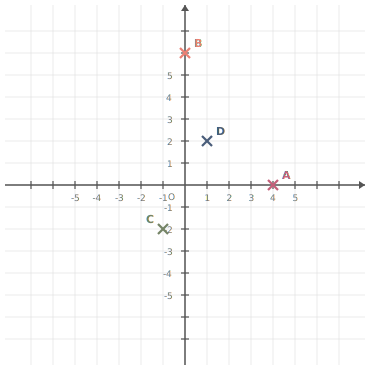
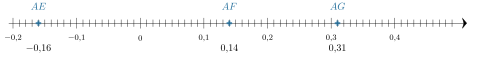
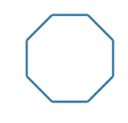
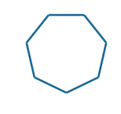
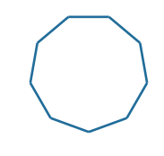
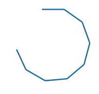




---Q---
Dans chaque colonne de ce tableau, il y a un unique nombre exprimé sous 3 formes différentes. Compléter ce tableau. $$ 
    \begin{array}{|c|c|c|c|c|c|c|}
    \hline
      \text{Nombre décimal} & 0{,}5 & \phantom{rrr} & \phantom{rrr} & \phantom{rrr} & 0{,}72 & \phantom{rrr}\\
    \hline
      \text{Fraction décimale} & \phantom{rrr} & \phantom{rrr} & \dfrac{55}{100} & \dfrac{90}{100} & \phantom{rrr} & \phantom{rrr}\\
    \hline
      \text{Pourcentage} & \phantom{rrr}\% & 98\,\% & \phantom{rrr}\% & \phantom{rrr}\% & \phantom{rrr}\% & 30\,\%\\
    \hline
    \end{array}
    $$
---CORR---
$$ 
    \begin{array}{|c|c|c|c|c|c|c|}
    \hline
      \text{Nombre décimal} &
    0{,}5 &
    \color{F15929}{\mathbf{0{,}98}} &
    \color{F15929}{\mathbf{0{,}55}} &
    \color{F15929}{\mathbf{0{,}9}} &
    0{,}72 &
    \color{F15929}{\mathbf{0{,}3}}\\
    \hline
      \text{Fraction décimale} &
    \color{F15929}{\mathbf{\frac{50}{100}}} &
    \color{F15929}{\mathbf{\frac{98}{100}}} &
    \frac{55}{100} &
    \frac{90}{100} &
    \color{F15929}{\mathbf{\frac{72}{100}}} &
    \color{F15929}{\mathbf{\frac{30}{100}}}\\
    \hline
      \text{Pourcentage} &
    \color{F15929}{\mathbf{50}}\,\% &
    98\,\% &
    \color{F15929}{\mathbf{55}}\,\% &
    \color{F15929}{\mathbf{90}}\,\% &
    \color{F15929}{\mathbf{72}}\,\% &
    30\,\%\\
    \hline
    \end{array}
    $$


---Q---
Calculer $A = (x + 13)(x + 9)$, pour $x = -3$.
---CORR---
$A = (-3 + 13) \times (-3 + 9)$ $A = 10 \times 6$ $A = {\color{#8B3C52}\boldsymbol{60}}$


---Q---
Placer les points suivants : $A(4\;;\;0)$ ; $B(0\;;\;6)$ ; $C(-1\;;\;-2)$ et $D(1\;;\;2)$.

      
---CORR---
Les points sont placés aux coordonnées indiquées : 


---Q---
Quynh a obtenu ces notes ce trimestre en mathématiques :  
    

$$
    10,\; 9,\; 9,\; 8,\; 6,\; 13,\; 6,\; 12,\; 11,\; 8.
    $$

    Calculer la fréquence de la note $13$.
---CORR---
La note $13$ a été obtenue $1$ fois. 
    Il y a $10$ notes. 
    Donc la fréquence de la note $13$ est : ${\color{#8B3C52}\boldsymbol{\dfrac{1}{10}}}={\color{#8B3C52}\boldsymbol{0{,}1}}$, soit $10\thickspace\%$.






---Q---
Compléter avec le signe < ou >. $-7{,}291 \quad \ldots\ldots   \quad-7{,}777$
---CORR---
$-7{,}291 \quad {\color{#8B3C52}\boldsymbol{>}} \quad -7{,}777$


---Q---
Choisis le calcul qui permet de résoudre l'équation suivante :  
Pour résoudre $5x-4=29$ :

      <strong>A</strong>. $29\times 5+4$&emsp;&emsp; 
    <strong>B</strong>. $\dfrac{29}{5}+4$&emsp;&emsp; 
    <strong>C</strong>. $(29-5)+4$&emsp;&emsp; 
    <strong>D</strong>. $\dfrac{29+4}{5}$
---CORR---
$5x-4=29$  
    On ajoute $4$ : $5x=29+4$.  
    Puis on divise par $5$ : $x=\dfrac{29+4}{5}$.  
    Bonne réponse : <strong>D</strong>.


---Q---
Dans la figure ci-dessous : 
$\widehat{HLF}$ est un angle :  
    
    	$\square\;$ nul&emsp;&emsp; $\square\;$ aigu&emsp;&emsp; $\square\;$ droit&emsp;&emsp; $\square\;$ obtus&emsp;&emsp; $\square\;$ plat&emsp;&emsp;   
---CORR---
Dans la figure ci-dessous : 
$\widehat{HLF}$ est un angle :  
    
    	$\square\;$ nul&emsp;&emsp; $\square\;$ aigu&emsp;&emsp; $\blacksquare\;$ droit&emsp;&emsp; $\square\;$ obtus&emsp;&emsp; $\square\;$ plat&emsp;&emsp;  
Un angle droit est un angle dont la mesure est égale à 90.  


---Q---
On donne la série statistique suivante : 
    $19$ ; $15$ ; $7$ ; $12$ ; $16$ ; $14$ ; $13$ ; $9$ ; $5$. 
    Parmi ces propositions, laquelle peut être la médiane de la série ?

     
      <strong>A</strong>. $14$&emsp;&emsp; <strong>B</strong>. $13$&emsp;&emsp; <strong>C</strong>. $12$&emsp;&emsp; <strong>D</strong>. $16$
---CORR---
La série triée dans l'ordre croissant est : $5$ ; $7$ ; $9$ ; $12$ ; $13$ ; $14$ ; $15$ ; $16$ ; $19$. 
    La série comporte $9$ valeurs, donc la médiane est le terme de rang $5$. 
    La médiane est donc $13$. 
    La bonne réponse est la réponse B.






---Q---
Déterminer la valeur de $25\,\%$ de $135$.
---CORR---
$25\,\%$ de $135$ :  
    $\dfrac{25 \times 135}{100} = 0{,}25 \times 135 = 33{,}75$.  
    Donc la valeur est 33.


---Q---
Lire l'abscisse de chacun des points suivants. 
---CORR---
 


---Q---
Calculer le périmètre du carré $ABCD$ représenté ci-dessous : 
---CORR---

	Le polygone a $4$ côtés de longueur $7{,}5$ cm. 
Le périmètre est donc égal à : 
$4 \times 7{,}5 = {\color{#8B3C52}\boldsymbol{30}}$ cm.



---Q---
Laquelle des 4 figures ci-dessous va être tracée avec le script fourni ?  

  

    
    
Figure A

  

  

    
    
Figure B

  

  

    
    
Figure C

  

  

    
    
Figure D

  

---CORR---
Voir la figure correspondant au code Scratch.



