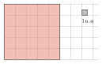



1
---Q---
Donner le nom de ce solide.

---CORR---
Cône de révolution.


2
---Q---
Quelle est la moyenne de la série statistique étudiée sur ce diagramme en barres ?  A. $3{,}5$ &emsp; B. $4$ &emsp; C. $3{,}375$ &emsp; D. $2$

---CORR---
Il y a un total de $8$ valeurs. La somme des valeurs : $3 \times 2+1 \times 3+3 \times 4+1 \times 6=27$. La moyenne est : $\dfrac{27}{8}={\color{#EB7F73}\boldsymbol{3{,}375}}$. La bonne réponse est la réponse C.


3
---Q---
Calculer l'aire exacte d'un rectangle de longueur $7~\text{cm}$ et de largeur $3{,}6~\text{cm}$.

---CORR---
$\mathcal{A}_\text{rectangle} = L \times l = 7~\text{cm} \times 3{,}6~\text{cm} = {\color{#EB7F73}\boldsymbol{25{,}2}}~\text{cm}^2$


4
---Q---
$7 \times 9 = 75 - \ldots$
---CORR---
$7 \times 9 = 75 - {\color{#EB7F73}\boldsymbol{12}}$


5
---Q---
Qu'est-ce qui caractérise les angles adjacents rose et violet ?

---CORR---
Ce sont des angles supplémentaires car la somme de leurs mesures est égale à $180°$ (angle plat).







1
---Q---
Benoît relève les prix des maquettes sur un catalogue par correspondance en fonction de la quantité saisie dans le panier. Il note les prix dans le tableau suivant :
<table style="border-collapse:collapse;margin:0.8rem auto;font-size:0.9rem">
<tr><th style="background:#FDF2F4;color:#8B3C52;border:1px solid #ddb8c0;padding:6px 12px;font-weight:600">Maquettes</th><td style="border:1px solid #ddb8c0;padding:6px 12px;text-align:center;color:#2D2226">$3$</td><td style="border:1px solid #ddb8c0;padding:6px 12px;text-align:center;color:#2D2226">$4$</td><td style="border:1px solid #ddb8c0;padding:6px 12px;text-align:center;color:#2D2226">$7$</td><td style="border:1px solid #ddb8c0;padding:6px 12px;text-align:center;color:#2D2226">$12$</td></tr>
<tr><th style="background:#FDF2F4;color:#8B3C52;border:1px solid #ddb8c0;padding:6px 12px;font-weight:600">Prix (en €)</th><td style="border:1px solid #ddb8c0;padding:6px 12px;text-align:center;color:#2D2226">$36$</td><td style="border:1px solid #ddb8c0;padding:6px 12px;text-align:center;color:#2D2226">$48$</td><td style="border:1px solid #ddb8c0;padding:6px 12px;text-align:center;color:#2D2226">$84$</td><td style="border:1px solid #ddb8c0;padding:6px 12px;text-align:center;color:#2D2226">$144$</td></tr>
</table>
Le prix des maquettes est-il proportionnel à la quantité achetée ?
---CORR---
$\dfrac{36}{3}=\dfrac{48}{4}=\dfrac{84}{7}=\dfrac{144}{12}=12~\text{€/maquette}$ Le prix des maquettes est bien proportionnel à leur nombre.


2
---Q---
Donner le nom de ce solide.
 

---CORR---
Pavé droit.


3
---Q---
Quelle est l'aire de la figure ?
 

---CORR---
L'aire de cette figure est : $5\times5\times4 = {\color{#EB7F73}\boldsymbol{100}}$ u.a.


4
---Q---
Quel est le carré de $8$ ?
---CORR---
Le carré d'un nombre est ce nombre multiplié par lui-même : $8\times8={\color{#EB7F73}\boldsymbol{64}}$


5
---Q---
À propos de l'angle ci-dessous, compléter la phrase par la case adéquate. $\widehat{YOL}$ est :  A. le sommet &emsp; B. un côté &emsp; C. le nom de l'angle &emsp; D. rien de cela
 

---CORR---
$\widehat{YOL}$ est rien de cela — réponse D. C'est l'angle de sommet $Y$, formé par les demi-droites $[YL)$ et $[YO)$, c'est donc l'angle $\widehat{LYO}$.






1
---Q---
Sur le plan du quartier de sa cousine, Yvette constate que $3~\text{mm}$ sur le plan correspond à $3~\text{m}$ dans la réalité. Quelle est l'échelle du plan ?
---CORR---
$3~\text{m} = 3\,000~\text{mm}$. Donc $3~\text{mm}$ sur le plan représente $3\,000~\text{mm}$ dans la réalité. L'échelle est $\dfrac{3}{3\,000}=\dfrac{1}{1\,000}$, donc ${\color{#EB7F73}\boldsymbol{\dfrac{1}{1\,000}}}$.


2
---Q---
On donne la série statistique suivante : $17$ ; $15$ ; $2$ ; $6$ ; $4$ ; $9$ ; $10$ ; $18$ ; $11$ ; $3$. Parmi ces propositions, laquelle peut être la médiane de la série ?  A. $6{,}5$ &emsp; B. $9$ &emsp; C. $9{,}5$ &emsp; D. $10$
---CORR---
Série triée : $2$ ; $3$ ; $4$ ; $6$ ; $9$ ; $10$ ; $11$ ; $15$ ; $17$ ; $18$. Il y a $10$ valeurs (pair), la médiane est la moyenne des termes de rang $5$ et $6$ : $\dfrac{9 + 10}{2} = {\color{#EB7F73}\boldsymbol{9{,}5}}$. La bonne réponse est la réponse C.


3
---Q---
Calculer l'aire exacte d'un triangle de base $3~\text{cm}$ et de hauteur $6~\text{cm}$.
---CORR---
$\mathcal{A}_\text{triangle} = (b \times h) \div 2 = (3~\text{cm} \times 6~\text{cm}) \div 2 = {\color{#EB7F73}\boldsymbol{9}}~\text{cm}^2$


4
---Q---
Donner la liste des 5 premiers multiples non nuls de $50$.
---CORR---
5 premiers multiples non nuls de $50$ : $50$ ; $100$ ; $150$ ; $200$ ; $250$.


5
---Q---
Compléter à l'aide des longueurs $TR$, $TS$ et $RS$ : $\cos\left(\widehat{TRS}\right)= \dfrac{\ldots}{\ldots}$
 

---CORR---
$TRS$ est rectangle en $T$ donc : $\cos\left(\widehat{TRS}\right)={\color{#EB7F73}\boldsymbol{\dfrac{TR}{RS}}}$



