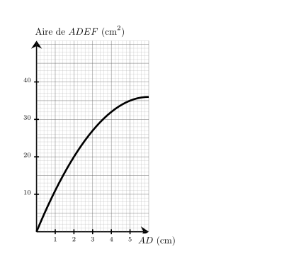
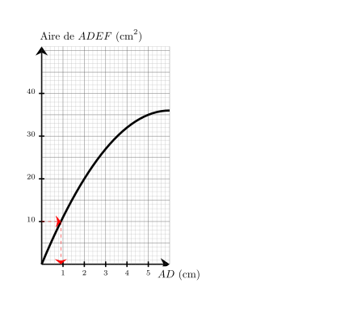
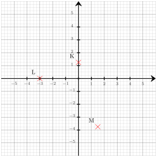




---Q---
Donner l'écriture décimale de $7{,}66 \times 10^{3}$.
---CORR---
$7{,}66 \times 10^{3} = {\color{#8B3C52}\mathbf{7\,660}}$.


---Q---
Tania lit sur sa recette de cake pour $3$ personnes qu'il faut $60$ g de farine.  Elle veut adapter sa recette pour $5$ personnes.  Quelle masse de farine doit-elle prévoir ?
---CORR---
Commençons par trouver la masse de farine pour une personne.   $3$ personnes, c'est ${\color{#C5607A}\boldsymbol{3}}$ fois $1$ personne. il faut donc ${\color{#C5607A}\boldsymbol{3}}$ fois moins que $60$ g pour $1$ personne. $60$ g $\div {\color{#C5607A}\boldsymbol{3}} = 20$ g   il faut ${\color{#C5607A}\boldsymbol{20}}$ g de farine pour $1$ personne.   Cherchons maintenant la quantité nécessaire pour 5 personnes.   $5$ personnes, c'est ${\color{#C5607A}\boldsymbol{5}}$ fois $1$ personne.  Donc, il faut ${\color{#C5607A}\boldsymbol{5}}$ fois plus que 20 g de farine que pour $1$ personne pour faire sa recette.  ${\color{#C5607A}\boldsymbol{20}}$ g $\times {\color{#C5607A}\boldsymbol{5}} = 100$ g  
 Tania doit utiliser ${\color{#8B3C52}\boldsymbol{100}}$ g de farine pour $5$ personnes.


---Q---
Donner le nom de chacun des solides.   
---CORR---
Sphère.


---Q---
$NOP$ est un triangle rectangle en $N$ dans lequel
      $NO=3$ et $NP=\sqrt{10}$. 
       Calculer la valeur exacte de $OP$ .
---CORR---
On utilise le théorème de Pythagore dans le triangle $NOP$,  rectangle en $N$. 
On obtient : 
$\begin{aligned}
OP^2&=NO^2+NP^2\\
OP^2&=\sqrt{10}^2+3^2\\
OP^2&=10+9\\
OP^2&=19\\
OP&={\color{#8B3C52}\boldsymbol{\sqrt{19}}}
\end{aligned}$







---Q---
Quel est le carré de $13$ ?
---CORR---
Le carré d'un nombre est ce nombre multiplié par lui-même : $13\times13=169$


---Q---
Sur le graphique ci-dessus, on a représenté la relation entre la longueur $AD$ et l'aire du rectangle $ADEF$. Quelle est la longueur $AD$ lorsque l'aire du rectangle $ADEF$ vaut $10\text{ cm}^2$ ? 
---CORR---
On cherche $AD$ tel que $Aire_{ADEF} = 10\text{ cm}^2$. 

On trouve $AD=0{,}9\text{ cm}$. 


---Q---
Compléter. $ 600\,\text{ dam}^3 = \ldots \,\text{m}^3$
---CORR---
$ 600\,\text{ dam}^3 =  600\times1000\,\text{m}^3 = 600\,000\,\text{m}^3$ 

$$\def\arraystretch{1.5}
\begin{array}{|c|c|c|c|c|c|c|}
\hline
\text{km}^3 & \text{hm}^3 & \text{dam}^3 & \text{m}^3 & \text{dm}^3 & \text{cm}^3 & \text{mm}^3 \\
\hline
\begin{array}{c|c|c}
\hspace*{0.2cm} & \hspace*{0.4cm} & \hspace*{0.2cm} \\
\hspace*{0.2cm} & \hspace*{0.4cm} & \hspace*{0.2cm}
\end{array}
&
\begin{array}{c|c|c}
\hspace*{0.2cm} & \hspace*{0.4cm} & \hspace*{0.2cm} \\
\hspace*{0.2cm} & \hspace*{0.4cm} & \hspace*{0.2cm}
\end{array}
&
\begin{array}{c|c|c}
6 & \hspace*{0.1cm}0\hspace*{0.1cm} & \color{red}{0} \\
6 & \hspace*{0.1cm}0\hspace*{0.1cm} & 0
\end{array}
&
\begin{array}{c|c|c}
\hspace*{0.2cm} & \hspace*{0.4cm} & \hspace*{0.2cm} \\
0 & \hspace*{0.1cm}0\hspace*{0.1cm} & \color{red}{0}
\end{array}
&
\begin{array}{c|c|c}
\hspace*{0.2cm} & \hspace*{0.4cm} & \hspace*{0.2cm} \\
\hspace*{0.2cm} & \hspace*{0.4cm} & \hspace*{0.2cm}
\end{array}
&
\begin{array}{c|c|c}
\hspace*{0.2cm} & \hspace*{0.4cm} & \hspace*{0.2cm} \\
\hspace*{0.2cm} & \hspace*{0.4cm} & \hspace*{0.2cm}
\end{array}
&
\begin{array}{c|c|c}
\hspace*{0.2cm} & \hspace*{0.4cm} & \hspace*{0.2cm} \\
\hspace*{0.2cm} & \hspace*{0.4cm} & \hspace*{0.2cm}
\end{array}
\\
\hline
\end{array}
$$


---Q---
 
Sur la figure ci-dessus, dans le triangle $PIK$, les droites $(IK)$ et $(TY)$ sont parallèles. Déterminer la longueur $PI$. 
---CORR---
Dans le triangle $PIK$, les droites $(IK)$ et $(TY)$ sont parallèles.  
    D'après le théorème de Thalès, on a :  
    $\dfrac{PI}{PY} =
    \dfrac{IK}{TY}$.  
    En remplaçant par les longueurs, on obtient :  
    $\dfrac{PI}{PY} = \dfrac{18}{12}=1{,}5$. 
    On en déduit que :  
    $PI = 1{,}5 \times 36 = {\color{#8B3C52}\boldsymbol{54}}$ cm.






---Q---
Écrire sous la forme de la somme d'un nombre entier et d'une fraction inférieure à 1 puis donner l'écriture décimale. $ \dfrac{5}{4} = \phantom{00}\text{........}\phantom{00} + \dfrac{\phantom{00}\text{........}\phantom{00}}{\phantom{00}\text{........}\phantom{00}} = \phantom{00}\text{........}\phantom{00}  $
---CORR---
$ \dfrac{5}{4} = {\color{#8B3C52}\boldsymbol{1}}+\dfrac{{\color{#8B3C52}\boldsymbol{1}}}{{\color{#8B3C52}\boldsymbol{4}}} = {\color{#8B3C52}\boldsymbol{1,25}} $


---Q---
Développer et réduire : $C=(-7z+8)\times (-11z)$
---CORR---
$C=(-7z+8)\times (-11z)$ $C={\color{blue}\boldsymbol{-11z\times (-7z)+(-11z)\times 8}}$ En réduisant l'expression, on obtient :   $C=$ ${\color{#8B3C52}\boldsymbol{77z^2-88z}}$.


---Q---
Déterminer les coordonnées respectives des points $L$, $K$ et $M$  
---CORR---
Les coordonnées respectives des points sont :  $L({\color{#8B3C52}\boldsymbol{-3}};{\color{#8B3C52}\boldsymbol{0}})$, $K({\color{#8B3C52}\boldsymbol{0}};{\color{#8B3C52}\boldsymbol{1{,}25}})$ et $M({\color{#8B3C52}\boldsymbol{1{,}5}};{\color{#8B3C52}\boldsymbol{-3{,}75}})$


---Q---
Dans le triangle $EFG$ rectangle en $E$,  $FG=13\text{ m}$ et $\widehat{EFG}=43^\circ$. Calculer $EF$ à $0,1\text{ m}$ près.   
---CORR---
Dans le triangle $EFG$ rectangle en $E$,  le cosinus de l'angle $\widehat{EFG}$ est défini par : $\cos\left(\widehat{EFG}\right)=\dfrac{EF}{FG}$. Avec les données numériques : $\dfrac{\cos\left(43^\circ\right)}{\color{red}{1}}=\dfrac{EF}{13}$  $EF=13 \times \cos\left(43^\circ\right)$ soit $EF\approx{\color{#8B3C52}\boldsymbol{9{,}5}}\text{ m}$.



