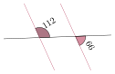
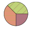



1
---Q---
$GHI$ est un triangle rectangle en $G$ dans lequel $GH=8$ et $GI=\sqrt{6}$. Calculer la valeur exacte de $HI$.

---CORR---
On utilise le théorème de Pythagore dans le triangle $GHI$, rectangle en $G$. $GH^2+GI^2=HI^2$ $HI^2=(\sqrt{6})^2+8^2=6+64=70$ $HI={\color{#EB7F73}\boldsymbol{\sqrt{70}}}$ Mentalement : n'oubliez pas que $(\sqrt{6})^2=6$. La valeur cherchée est donc : $\sqrt{70}$.


2
---Q---
Donner le nom de ce solide.
 

---CORR---
Sphère.


3
---Q---
Donner la formule de l'aire d'un carré de côté $c$.
---CORR---
Aire d'un carré $= {\color{#EB7F73}\boldsymbol{c \times c}}$


4
---Q---
Exprimer le quotient de $t$ par 5 en fonction de $t$.
---CORR---
Le quotient de $t$ par 5 peut se noter : ${\color{#EB7F73}\boldsymbol{\dfrac{t}{5}}}$ ou ${\color{#EB7F73}\boldsymbol{t\div 5}}$.


5
---Q---
Les droites roses sont-elles parallèles ?
 

---CORR---
$180°-{\color{#C5607A}\boldsymbol{112°}} = {\color{#C5607A}\boldsymbol{68°}}$ Les angles rouge et vert sont correspondants mais pas de même mesure. Donc les droites rouges ne sont pas parallèles.







11
---Q---
Sur $160$ visiteurs dans un musée, on distingue trois groupes : - adultes : $100$ visiteurs ; - enfants : $40$ visiteurs ; - seniors : les autres. Quel diagramme circulaire représente la situation ?

<strong>A.</strong> 

<strong>B.</strong> 

<strong>C.</strong> 

<strong>D.</strong> 

---CORR---
Effectifs : adultes $= 100$, enfants $= 40$, seniors $= 160-100-40 = 20$. Parts : $\dfrac{100}{160}=\dfrac{5}{8}$ → $225°$ ; $\dfrac{40}{160}=\dfrac{1}{4}$ → $90°$ ; $\dfrac{20}{160}=\dfrac{1}{8}$ → $45°$. Le bon diagramme est le seul avec un angle rentrant ($225°$), un angle droit ($90°$) et un angle aigu ($45°$). La bonne réponse est la réponse A.


22
---Q---
Isabelle doit acheter du gazon. Sur la notice, il est indiqué de prévoir $3~\text{kg}$ pour $40~\text{m}^2$. Combien doit-elle en acheter pour une surface de $20~\text{m}^2$ ?
---CORR---
Pour $1~\text{m}^2$ : $3~\text{kg}\div 40 = 0{,}075~\text{kg}$. Pour $20~\text{m}^2$ : $0{,}075~\text{kg}\times 20 = {\color{#EB7F73}\boldsymbol{1{,}5}}~\text{kg}$.


33
---Q---
Calculer l'aire exacte d'un disque de diamètre $10~\text{cm}$.
---CORR---
Rayon $= 5~\text{cm}$. $\mathcal{A}_\text{disque} = r \times r \times \pi = 5~\text{cm} \times 5~\text{cm} \times \pi = {\color{#EB7F73}\boldsymbol{25\pi}}~\text{cm}^2$


44
---Q---
Réduire l'expression suivante, si cela est possible. $A=-5x\times (-10)$
---CORR---
$A=-5x\times (-10)={\color{#EB7F73}\boldsymbol{50x}}$


55
---Q---
Qu'est-ce qui caractérise les angles rose et violet ?
 

---CORR---
Ce sont des angles opposés par le sommet.






1
---Q---
Zacharie prépare un cocktail à base de sirop de fraise, de jus d'abricot et d'eau gazeuse pour ses amis. Il mélange les trois ingrédients dans le ratio $2:7:10$. Il verse $40~\text{cL}$ de sirop de fraise. Quelle quantité de jus d'abricot et d'eau gazeuse doit-il ajouter et quelle quantité de cocktail obtiendra-t-il ?
---CORR---
$\dfrac{40~\text{cL}}{2}=20$, donc : Volume de jus d'abricot : $20\times 7 = {\color{#EB7F73}\boldsymbol{140~\text{cL}}}$. Volume d'eau gazeuse : $20\times 10 = {\color{#EB7F73}\boldsymbol{200~\text{cL}}}$. Volume total de cocktail : $40+140+200 = {\color{#EB7F73}\boldsymbol{380~\text{cL}}}$.


2
---Q---
Donner le nom de ce solide.
 

---CORR---
Cube.


3
---Q---
$1~\text{m}^2 = 1~\text{m} \times 1~\ldots = 10~\ldots \times 10~\text{dm} = 10 \times \ldots~\text{dm}^2 = \ldots~\text{dm}^2$
---CORR---
$1~\text{m}^2 = 1~\text{m} \times 1~{\color{#EB7F73}\boldsymbol{\text{m}}} = 10~{\color{#EB7F73}\boldsymbol{\text{dm}}} \times 10~\text{dm} = 10 \times {\color{#EB7F73}\boldsymbol{10}}~\text{dm}^2 = {\color{#EB7F73}\boldsymbol{100}}~\text{dm}^2$


4
---Q---
Résoudre : $-12y+3=-10y-4$
---CORR---
$$\begin{aligned}
-12y+3 &= -10y-4 \\
-12y+3{\color{#C5607A}\boldsymbol{+10y}} &= -10y-4{\color{#C5607A}\boldsymbol{+10y}} \\
-2y+3 &= -4 \\
-2y+3{\color{#C5607A}\boldsymbol{-3}} &= -4{\color{#C5607A}\boldsymbol{-3}} \\
-2y &= -7 \\
-2y{\color{#C5607A}\boldsymbol{\div(-2)}} &= -7{\color{#C5607A}\boldsymbol{\div(-2)}} \\
y &= {\color{#EB7F73}\boldsymbol{\dfrac{7}{2}}}
\end{aligned}$$


5
---Q---
Dans le triangle $GHI$ rectangle en $G$, $HI=10~\text{m}$ et $\widehat{GHI}=44^\circ$. Quel calcul permet de trouver la longueur GH ?
 

---CORR---
$\cos\left(\widehat{GHI}\right)=\dfrac{GH}{HI}$ $\cos\left(44^\circ\right)=\dfrac{GH}{10}$ $GH=10 \times \cos\left(44^\circ\right)$.



