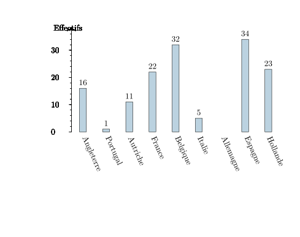
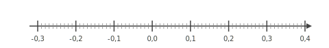
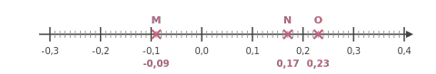
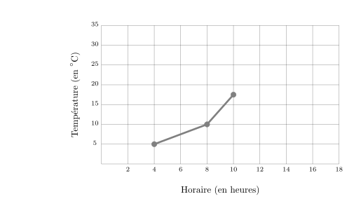
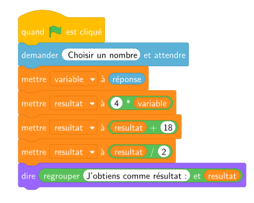




---Q---
Calculer. $ (-4) - (+3) $
---CORR---
$  {\color{#008002}\boldsymbol{(-4)}} - {\color{blue}\boldsymbol{(+3)}} = {\color{#f15929}\boldsymbol{(-7)}} $


---Q---
Résoudre les équations suivantes. $7y-11=-9y-1$
---CORR---
$7y-11=-9y-1$ On ajoute $9y$ aux deux membres. $7y-11{\color{#216D9A}\boldsymbol{\,\,+\,\,9y}}=-9y-1{\color{#216D9A}\boldsymbol{\,\,+\,\,9y}}$ $16y-11=-1$ On ajoute $11$ aux deux membres. $16y-11{\color{#216D9A}\boldsymbol{\,\,+\,\,11}}=-1{\color{#216D9A}\boldsymbol{\,\,+\,\,11}}$ $16y=10$ On divise les deux membres par $16$. $16y{\color{#216D9A}\boldsymbol{\,\div\,16}}=10{\color{#216D9A}\boldsymbol{\,\div\,16}}$ $y=\dfrac{10}{16}$ $y=\dfrac{5}{8}$  La solution de l'équation $7y-11=-9y-1$ est ${\color{#F15929}\boldsymbol{\dfrac{5}{8}}}$.


---Q---
Les angles $\widehat{xOy}$ et $\widehat{yOz}$ sont adjacents. 
          L'angle $\widehat{xOy}$ mesure $44^\circ$. 
          Combien mesure l'angle $\widehat{yOz}$ s'ils sont complémentaires l'un de l'autre ?
---CORR---
Deux angles adjacents complémentaires sont deux angles dont les côtés non communs forment un angle droit. 
          Alors $\widehat{yOz}=90^\circ-44^\circ={\color{#F15929}\boldsymbol{46^\circ}}$.


---Q---
Dans un salon européen de esport comptant 150 visiteurs, on a noté leur pays d'origine. On a représenté ces données à l'aide du diagramme ci-dessous. 

 

<strong>a.</strong> Déterminer l'effectif manquant. 
<strong>b.</strong> Déterminer les fréquences pour chaque pays d'origine (en pourcentage, arrondir au dixième si besoin). 
---CORR---
<strong>a.</strong> L'effectif manquant est celui du allemagne. Soit $e$ cet effectif. $e=150-( 16 + 1 + 11 + 22 + 32 + 5 + 34 + 23 )$ $e=150-144$ $e={\color{#F15929}\boldsymbol{6}}$ 
<strong>b.</strong> Calculs des fréquences. On rappelle que pour la fréquence relative à une valeur est donnée par le quotient : $\dfrac{\text{effectif de la valeur}}{\text{effectif total}}$ 

 
On en déduit donc les calculs suivants :

 
$$ 
\begin{array}{|c|c|c|c|c|c|c|c|c|c|}
\hline
   &   \text{Angleterre} &   \text{Portugal} &   \text{Autriche} &   \text{France} &   \text{Belgique} &   \text{Italie} &   \text{Allemagne} &   \text{Espagne} &   \text{Hollande}\\
\hline
  \mathbf{Fréquences} & \dfrac{16}{150} & \dfrac{1}{150} & \dfrac{11}{150} & \dfrac{22}{150} & \dfrac{32}{150} & \dfrac{5}{150} & \dfrac{6}{150} & \dfrac{34}{150} & \dfrac{23}{150}\\
\hline
   \mathbf{Fréquences en pourcentages} & {\color{#F15929}\boldsymbol{10{,}7 \,\%}} & {\color{#F15929}\boldsymbol{0{,}7 \,\%}} & {\color{#F15929}\boldsymbol{7{,}3 \,\%}} & {\color{#F15929}\boldsymbol{14{,}7 \,\%}} & {\color{#F15929}\boldsymbol{21{,}3 \,\%}} & {\color{#F15929}\boldsymbol{3{,}3 \,\%}} & {\color{#F15929}\boldsymbol{4 \,\%}} & {\color{#F15929}\boldsymbol{22{,}7 \,\%}} & {\color{#F15929}\boldsymbol{15{,}3 \,\%}}\\
\hline
 \end{array}
 $$
 






---Q---
Dans une ville, $25\%$ des 10000 habitants participent à une campagne de vaccination. 
    Combien d'habitants ne participent pas à cette campagne ?
---CORR---
Le nombre d'habitants participant à cette campagne est égal à : 
    $10\,000 \times \dfrac{25}{100} = 2\,500$. 
    Le nombre d'habitants ne participant pas à cette campagne est donc égal à : 
    $10\,000 - 2\,500 = {\color{#F15929}\boldsymbol{7\,500}}$.

 
Une autre méthode consiste à calculer le pourcentage d'habitants ne participant pas à cette campagne, qui est égal à $100\% - 25\% = 75\%$. 
    Le nombre d'habitants ne participant pas à cette campagne est donc égal à : 
    $10\,000 \times \dfrac{75}{100} = {\color{#F15929}\boldsymbol{7\,500}}$.


---Q---
Placer les points : $M(-0{,}09), N(0{,}17), O(0{,}23)$.

 
---CORR---



---Q---
Calculer le périmètre exact des figures suivantes. Cercle de diamètre $9\text{ cm}$
---CORR---
$\mathcal{P}_\text{cercle} = d \times \pi$ $\mathcal{P}_\text{cercle} = {\color{#F15929}\boldsymbol{9\pi}}\text{ cm}$


---Q---
Le graphique ci-dessous donne l’évolution de la température (en degrés Celsius) en
fonction de l’horaire (en heures). 
Entre $4$h et $10$h, de combien de degrés la température a-t-elle augmenté ? 
  
---CORR---
D’après le graphique, à $4$h, la température est de $5$$^\circ$ C et à $10$h, elle est de $17{,}5$$^\circ$ C. 
    L’augmentation de la température entre $4$h et $10$h est donc de : $17{,}5-5={\color{#F15929}\boldsymbol{12{,}5}}$$^\circ$ C.






---Q---
Donner l'écriture scientifique de $-8\,800$$\,=$$\,\dots$
---CORR---
$-8\,800 = {\color{#F15929}\boldsymbol{-8{,}8\times 10^{3}}}$


---Q---
Nathalie doit acheter du carrelage.  Sur la notice, il est indiqué de prévoir $25$ carreaux pour $2\text{ m}^2$.   Combien doit-elle en acheter pour une surface de $1{,}5\text{ m}^2$ ?
---CORR---
Commençons par trouver combien de carreaux il faut prévoir pour $1\text{ m}^2$.  
 $1\text{ m}^2$, c'est ${\color{#216D9A}\boldsymbol{2}}$ fois moins que 2$\text{ m}^2$. $25$ carreaux $\div {\color{#216D9A}\boldsymbol{2}} = 12{,}5$ carreaux   on a donc besoin de ${\color{#216D9A}\boldsymbol{12{,}5}}$ carreaux pour recouvrir $1\text{ m}^2$.  Cherchons maintenant la quantité de carreaux nécessaire pour recouvrir $1{,}5\text{ m}^2$.  $1{,}5\text{ m}^2$, c'est ${\color{#216D9A}\boldsymbol{1{,}5}}$ fois plus que $1\text{ m}^2$.  ${\color{#216D9A}\boldsymbol{12{,}5}}$ carreaux $\times {\color{#216D9A}\boldsymbol{1{,}5}} = 18{,}75$ carreaux  Nathalie aura besoin de ${\color{#F15929}\boldsymbol{18{,}75}}$ carreaux pour recouvrir $1{,}5\text{ m}^2$.


---Q---
Calculer le volume, arrondi au $\text{ dm}^3$ près, d'une boule de $3\text{ dm}$ de rayon.
---CORR---
$\mathcal{V}=\dfrac{4}{3} \times \pi \times R^3=\dfrac{4}{3}\times\pi\times\left(3\text{ dm}\right)^3=\dfrac{108}{3}\pi\text{ dm}^3\approx{\color{#F15929}\boldsymbol{113\mathbf{ dm}^3}}$


---Q---
On considère l’algorithme suivant :

    

    Qu’obtient‑on si on choisit $1$ comme nombre de départ ? 
---CORR---
Si on choisit $1$ comme nombre de départ, alors variable prend la valeur $1$. 
    Ensuite, resultat prend la valeur $4 \times 1 = 4$. 
    Puis, resultat prend la valeur $4 + 18 = 22$. 
    Enfin, resultat prend la valeur $\dfrac{22}{2} = 11$. 
    Résultat final : ${\color{#F15929}\mathbf{11}}$.



