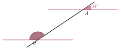
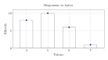
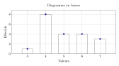



1
---Q---
Nawel veut réaliser une vinaigrette. Pour cela elle mélange du vinaigre et de l'huile d'olive selon le ratio $4:7$. Elle utilise $21$ cuillères à soupe d'huile d'une contenance de $15~\text{mL}$ chacune. a. Quel volume de vinaigre doit-elle utiliser ? b. Quel volume de vinaigrette Nawel réalisera-t-elle ?
---CORR---
Volume total d'huile : $21\times 15 = 315~\text{mL}$. La part est $\dfrac{315}{7}=45$. a. Volume de vinaigre : $45\times 4~\text{mL}={\color{#EB7F73}\boldsymbol{180~\text{mL}}}$. b. Volume de vinaigrette : $45\times(4+7)~\text{mL}=45\times 11={\color{#EB7F73}\boldsymbol{495~\text{mL}}}$.


2
---Q---
$6$ ; $15$ ; $8$ ; $15$ La moyenne de cette série est :  A. $11$ &emsp; B. $13$ &emsp; C. $11{,}5$ &emsp; D. $12$

---CORR---
La somme des $4$ valeurs est : $6+15+8+15=44$. La moyenne est donc $\dfrac{44}{4}={\color{#EB7F73}\boldsymbol{11}}$. La bonne réponse est la réponse A.


3
---Q---
$1~\text{dm}^2 = \ldots~\text{m}^2$
---CORR---
$1~\text{dm}^2$ est égal à un centième de $1~\text{m}^2$. $1~\text{dm}^2 = {\color{#EB7F73}\boldsymbol{\dfrac{1}{100}}}~\text{m}^2 = {\color{#EB7F73}\boldsymbol{0{,}01}}~\text{m}^2$


4
---Q---
Traduire la phrase par un calcul. Le produit de la somme de $x$ et $3$ par la somme de $3$ et $y$.
---CORR---
Le produit de la somme de $x$ et $3$ par la somme de $3$ et $y$ s'écrit : ${\color{#EB7F73}\boldsymbol{(x+3)\times(3+y)}}$.


5
---Q---
Sachant que les droites rouges sont parallèles, en déduire la mesure de l'angle violet. Justifier.
 

---CORR---
Les angles rouge et vert sont correspondants et formés par des droites parallèles, donc ils sont de même mesure. De plus, $180°-{\color{#C5607A}\boldsymbol{34°}} = {\color{#C5607A}\boldsymbol{146°}}$. L'angle bleu mesure donc ${\color{#EB7F73}\boldsymbol{146°}}$.






1
---Q---
Un décapant biologique est vendu sous forme concentrée avec l'indication suivante sur le bidon : Diluer avec de l'eau à $2:5$. À quel pourcentage de produit concentré dans le mélange final correspond ce ratio ? (arrondir à l'unité).
---CORR---
Une dilution selon le ratio $2:5$ signifie qu'on dilue $2$ unités de volume dans $5$ unités d'eau, soit $7$ unités au total. La proportion de décapant biologique est : $\dfrac{2}{7}\approx 0{,}286$, soit environ ${\color{#EB7F73}\boldsymbol{29~\%}}$.


2
---Q---
Calculer le volume d'un pavé droit de $5~\text{cm}$ de profondeur, de $0{,}6~\text{dm}$ de longueur et de $40~\text{mm}$ de hauteur.
---CORR---
En convertissant tout en cm : $0{,}6~\text{dm}=6~\text{cm}$ et $40~\text{mm}=4~\text{cm}$. $\mathcal{V}= l \times L \times h = 5~\text{cm}\times6~\text{cm}\times4~\text{cm}={\color{#EB7F73}\boldsymbol{120~\text{cm}^3}}$


3
---Q---
Calculer : $\dfrac{2}{4}- \Big(\dfrac{4}{16} + \dfrac{3}{4}\Big)$
---CORR---
$\dfrac{2}{4}- \Big(\dfrac{4}{16} + \dfrac{3}{4}\Big)=\dfrac{2}{4} - \Big(\dfrac{4}{16} + \dfrac{12}{16}\Big)=\dfrac{2}{4} - \dfrac{16}{16}=\dfrac{8}{16} - \dfrac{16}{16}= {\color{#EB7F73}\boldsymbol{-\dfrac{8}{16}}}$


4
---Q---
Dans le triangle $STU$ rectangle en $S$, $ST=8~\text{mm}$ et $\widehat{STU}=42^\circ$. Donner le calcul permettant d'obtenir $TU$.
---CORR---
$\cos\left(\widehat{STU}\right)=\dfrac{ST}{TU}$, donc : ${\color{#EB7F73}\boldsymbol{\cos(42^\circ)=\dfrac{8}{TU}}}$.


5
---Q---
Quel est le pourcentage d'élèves ayant obtenu la moyenne ?  A. $78~\%$ &emsp; B. $68~\%$ &emsp; C. $63~\%$ &emsp; D. $58~\%$
 

---CORR---
Effectif total : $8+10+6+1=25$ élèves. Élèves ayant obtenu la moyenne ($\geq 5$) : $10+6+1=17$. $\dfrac{17}{25}\times 100 = {\color{#EB7F73}\boldsymbol{68}}~\%$. La bonne réponse est la réponse B.






1
---Q---
Soit $STU$ un triangle rectangle en $T$, tel que $ST=2$ et $SU=10$. Déterminer la valeur exacte de $TU$.
---CORR---
On utilise le théorème de Pythagore dans le triangle $STU$, rectangle en $T$. $TU^2=SU^2-ST^2=10^2-2^2=100-4=96$ $TU={\color{#EB7F73}\boldsymbol{\sqrt{96}}}={\color{#EB7F73}\boldsymbol{4\sqrt{6}}}$ Mentalement : La différence vaut $100-4=96$. La valeur cherchée est donc : $\sqrt{96}=4\sqrt{6}$.


2
---Q---
Quel est le pourcentage d'élèves ayant obtenu la note 4 ?  A. $40~\%$ &emsp; B. $45~\%$ &emsp; C. $50~\%$ &emsp; D. $60~\%$
 

---CORR---
Effectif total : $1+8+4+4+3=20$ élèves. Élèves ayant la note 4 : $8$. $\dfrac{8}{20}\times 100 = {\color{#EB7F73}\boldsymbol{40}}~\%$. La bonne réponse est la réponse A.


3
---Q---
Donner la formule de l'aire d'un rectangle de longueur $L$ et la largeur $l$.
---CORR---
Aire d'un rectangle $= {\color{#EB7F73}\boldsymbol{L \times l}}$


4
---Q---
51 est-il un nombre premier.
---CORR---
Comme $5 + 1 = 6$ est un multiple de $3$, donc $51$ aussi. $51$ admet au moins trois diviseurs : $1$, $3$ et lui-même. $51$ n'est donc pas premier.


5
---Q---
Qu'est-ce qui caractérise les angles adjacents rose et violet ?
 

---CORR---
Ce sont des angles complémentaires car la somme de leurs mesures est égale à $90°$ (angle droit).



