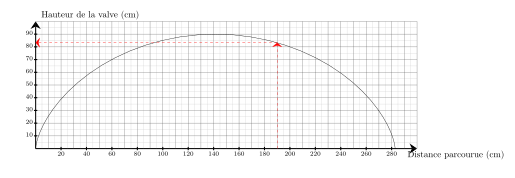
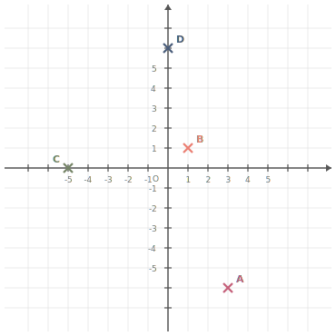




---Q---
Calculer le carré de $5$
---CORR---
$5^2={\color{#F15929}\boldsymbol{25}}$


---Q---
Sur le graphique ci-dessus, on a représenté la hauteur de la valve d'une roue de vélo en fonction de la distance parcourue en $\text{cm}$ lors d'un tour complet. Quelle est la hauteur de la valve lorsque la distance parcourue est de $190\text{ cm}$ ? 
---CORR---
La hauteur de la valve lorsque la distance parcourue est de $190\text{ cm}$ est de $83\text{ cm}$. 


---Q---
Convertir $9\,851\,\text{s}$ en heures, minutes et secondes.
---CORR---
$9\,851\,\text{s} = (2\times3\,600\,\text{s})+2\,651\,\text{s} =2\,\text{h}+(44\times60\,\text{s})+11\,\text{s}= {\color{#F15929}\boldsymbol{2\,\mathbf{h}\,44\,\mathbf{min}\,11\,\mathbf{s}}}$


---Q---
Déterminer la valeur exacte de $XY$.  
---CORR---
On utilise le théorème de Pythagore dans le triangle $WXY$,  rectangle en $X$. 
      On obtient :

 

      $\begin{aligned}
        WX^2+XY^2&=WY^2\\
        XY^2&=WY^2-WX^2\\
        XY^2&=10^2-3^2\\
        XY^2&=100-9\\
        XY^2&=91\\
        XY&={\color{#F15929}\boldsymbol{\sqrt{91}}}
        \end{aligned}$






---Q---
Donner la valeur décimale de  $\dfrac{5}{2}$.
---CORR---
$\dfrac{5}{2}={\color{#F15929}\boldsymbol{2{,}5}}$ 
            Mentalement :  
          $\dfrac{5}{2}=5\div 2=2{,}5$.


---Q---
Factoriser :  $C=11n+22k$
---CORR---
$C=11n+22k$ $\phantom{C}=11n+11\times2k$ $\phantom{C}=$ ${\color{#F15929}\boldsymbol{11(n+2k)}}$


---Q---
Placer les points suivants : $A(3\;;\;-6)$ ; $B(1\;;\;1)$ ; $C(-5\;;\;0)$ et $D(0\;;\;6)$.

      
---CORR---
Les points sont placés aux coordonnées indiquées : 


---Q---
Sur la figure suivante : 
          $\leadsto O$ est sur $[NL]$,
          $\leadsto P$ est sur $[NM]$,  $\leadsto$ les droites $(LM)$ et $(OP)$ sont parallèles. Écrire la double égalité de Thalès.  
---CORR---
Dans le triangle $LMN$ :
         $\leadsto$ $O\in[NL]$,
         $\leadsto$ $P\in[NM]$,
         $\leadsto$  $(LM)//(OP)$,
         donc d'après le théorème de Thalès, les triangles $LMN$ et $OPN$ ont des longueurs proportionnelles.

 
$\dfrac{NO}{NL}=\dfrac{NP}{NM}=\dfrac{OP}{LM}$  <strong>Remarque</strong> On pourrait aussi écrire : $\dfrac{NL}{NO}=\dfrac{NM}{NP}=\dfrac{LM}{OP}$






---Q---
Compléter avec le signe < ou >. $7{,}21 \quad \ldots\ldots   \quad7{,}4$
---CORR---
$7{,}21 \quad {\color{#F15929}\boldsymbol{<}} \quad 7{,}4$


---Q---
Choisis le calcul qui permet de résoudre l'équation suivante :  
Pour résoudre $4x-9=10$ :

      <strong>A</strong>. $\dfrac{10+9}{4}$&emsp;&emsp; 
    <strong>B</strong>. $\dfrac{10}{4}+9$&emsp;&emsp; 
    <strong>C</strong>. $10\times 4+9$&emsp;&emsp; 
    <strong>D</strong>. $(10-4)+9$
---CORR---
$4x-9=10$   
    On ajoute $9$ : $4x=10+9$.   
    Puis on divise par $4$ : $x=\dfrac{10+9}{4}$.   
    Bonne réponse :   <strong>A</strong>.


---Q---
Compléter. Un angle droit mesure … $^\circ$.
---CORR---
Un angle droit mesure ${\color{#F15929}\boldsymbol{90}}^\circ$.


---Q---
Exprimer $\cos(\widehat{VUW})$ de deux manières :  
    

$$
    \cos(\widehat{VUW})=\dfrac{\ldots}{\ldots}
    \qquad\text{et}\qquad
    \cos(\widehat{VUW})=\dfrac{\ldots}{\ldots}
    $$ 
---CORR---
$VUW$ est rectangle en $V$ donc :
    

$$
    \cos\left(\widehat{VUW}\right)
    = {\color{#F15929}\mathbf{\dfrac{VU}{UW}}}.
    $$

    $VUT$ est rectangle en $T$ donc :
    

$$
    \cos\left(\widehat{VUW}\right)
    = {\color{#F15929}\mathbf{\dfrac{UT}{VU}}}.
    $$



