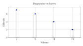
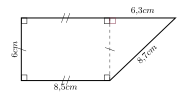



11
---Q---
Le triangle $MNO$ est tel que $MO=4~\text{cm}$, $MN=6~\text{cm}$ et $NO=3~\text{cm}$. Ce triangle est-il rectangle ?

---CORR---
Dans le triangle $MNO$, le plus grand côté est $[MN]$. $MN^2=6^2=36$ $MO^2+NO^2=4^2+3^2=16+9=25$ On constate que $MN^2\not=MO^2+NO^2$, l'égalité de Pythagore n'est pas vérifiée. D'après la contraposée du théorème de Pythagore, le triangle $MNO$ n'est pas rectangle.


22
---Q---
On donne la série statistique suivante : $10$ ; $5$ ; $15$ ; $6$. Quelle valeur faut-il ajouter à la série pour que sa moyenne soit égale à $10$ ?  A. $13$ &emsp; B. $12$ &emsp; C. $17$ &emsp; D. $14$

---CORR---
La somme des valeurs : $10+5+15+6=36$. $\dfrac{36+x}{5}=10 \Rightarrow 36+x=50 \Rightarrow x=10\times5-36={\color{#EB7F73}\boldsymbol{14}}$. La bonne réponse est la réponse D.


33
---Q---
Calculer le volume exact d'une boule de $2~\text{dm}$ de rayon.

---CORR---
$\mathcal{V}=\dfrac{4}{3} \times \pi \times R^3=\dfrac{4}{3}\times\pi\times(2~\text{dm})^3={\color{#EB7F73}\boldsymbol{\dfrac{32}{3}\pi}}~\text{dm}^3$


44
---Q---
Donner la liste de tous les diviseurs de $20$.

---CORR---
Diviseurs de $20$ : $1$ ; $2$ ; $4$ ; $5$ ; $10$ ; $20$.


55
---Q---
a. Déterminer la mesure de l'angle $\widehat{SMC}$. b. En déduire la mesure de l'angle $\widehat{MCS}$. c. Déterminer si les droites $(SC)$ et $(TE)$ sont parallèles. d. Si les segments $[SC]$ et $[TE]$ sont de même longueur, déterminer la nature du quadrilatère $SCET$.
 

---CORR---
a. Les angles $\widehat{SMC}$ et $\widehat{CME}$ sont supplémentaires, donc $\widehat{SMC}=180°-98°={\color{#EB7F73}\boldsymbol{82°}}$. b. Dans un triangle, la somme des angles vaut $180°$ donc $\widehat{SCM}=180°-45°-82°={\color{#EB7F73}\boldsymbol{53°}}$. c. Les angles $\widehat{SCM}$ et $\widehat{ETM}$ sont des angles alternes-internes. Si des angles alternes-internes sont égaux, les droites sont parallèles. Les droites $(SC)$ et $(TE)$ sont donc parallèles. d. $(SC)\parallel(TE)$ et $SC=TE$ donc $SCET$ est un parallélogramme et $M$ est son centre.






1
---Q---
Résoudre ce problème, lié à une échelle sur un plan. Le plan du pays de la sœur de Gabrielle a une échelle de $\dfrac{1}{5\,000\,000}$. Gabrielle mesure, sur ce plan, un segment de $3{,}9~\text{cm}$. À quelle distance réelle, ce segment correspond-il ?
---CORR---
Une échelle de $\dfrac{1}{5\,000\,000}$ signifie que $1~\text{cm}$ sur le plan représente $5\,000\,000~\text{cm}$ en réalité, soit $50~\text{km}$. $3{,}9~\text{cm}\times 50~\text{km} = {\color{#EB7F73}\boldsymbol{195~\text{km}}}$.


2
---Q---
Voici les $5$ notes sur vingt obtenues par un élève en mathématiques :
<table style="border-collapse:collapse;margin:0.8rem auto;font-size:0.9rem">
<tr><th style="background:#FDF2F4;color:#8B3C52;border:1px solid #ddb8c0;padding:6px 12px;font-weight:600">Devoir</th><td style="border:1px solid #ddb8c0;padding:6px 12px;text-align:center;color:#2D2226">$1$</td><td style="border:1px solid #ddb8c0;padding:6px 12px;text-align:center;color:#2D2226">$2$</td><td style="border:1px solid #ddb8c0;padding:6px 12px;text-align:center;color:#2D2226">$3$</td><td style="border:1px solid #ddb8c0;padding:6px 12px;text-align:center;color:#2D2226">$4$</td><td style="border:1px solid #ddb8c0;padding:6px 12px;text-align:center;color:#2D2226">$5$</td></tr>
<tr><th style="background:#FDF2F4;color:#8B3C52;border:1px solid #ddb8c0;padding:6px 12px;font-weight:600">Note</th><td style="border:1px solid #ddb8c0;padding:6px 12px;text-align:center;color:#2D2226">$15$</td><td style="border:1px solid #ddb8c0;padding:6px 12px;text-align:center;color:#2D2226">$12$</td><td style="border:1px solid #ddb8c0;padding:6px 12px;text-align:center;color:#2D2226">$14$</td><td style="border:1px solid #ddb8c0;padding:6px 12px;text-align:center;color:#2D2226">$10$</td><td style="border:1px solid #ddb8c0;padding:6px 12px;text-align:center;color:#2D2226">$x$</td></tr>
<tr><th style="background:#FDF2F4;color:#8B3C52;border:1px solid #ddb8c0;padding:6px 12px;font-weight:600">Coefficient</th><td style="border:1px solid #ddb8c0;padding:6px 12px;text-align:center;color:#2D2226">$1$</td><td style="border:1px solid #ddb8c0;padding:6px 12px;text-align:center;color:#2D2226">$1$</td><td style="border:1px solid #ddb8c0;padding:6px 12px;text-align:center;color:#2D2226">$1$</td><td style="border:1px solid #ddb8c0;padding:6px 12px;text-align:center;color:#2D2226">$1$</td><td style="border:1px solid #ddb8c0;padding:6px 12px;text-align:center;color:#2D2226">$3$</td></tr>
</table>
On cherche ce que doit valoir $x$ pour que la moyenne de l'élève soit égale à $15$.  A. Impossible (note $> 20$) &emsp; B. $x=15$ &emsp; C. $x=18$ &emsp; D. $x=16$
---CORR---
Somme $= 15+12+14+10+3x = 51+3x$. Somme des coeff. $= 7$. $\dfrac{51+3x}{7}=15 \Rightarrow 51+3x=105 \Rightarrow 3x=54 \Rightarrow x={\color{#EB7F73}\boldsymbol{18}}$. La bonne réponse est la réponse C.


3
---Q---
Calculer le volume, arrondi au $\text{m}^3$ près, d'une pyramide de hauteur $5~\text{m}$ et dont la base est un carré de $10~\text{m}$ de côté.
---CORR---
$\mathcal{V}=\dfrac{1}{3} \times \mathcal{B} \times h=\dfrac{1}{3}\times(10~\text{m})^2\times5~\text{m}={\color{#EB7F73}\boldsymbol{\dfrac{500}{3}}}~\text{m}^3$


4
---Q---
Voici les 3 premiers motifs d'une série de motifs figuratifs. Les motifs se succèdent selon une règle bien définie. Quel sera le nombre d'étoiles dans le motif au rang $n$ en fonction de $n$ ?
 

 

 

---CORR---
Le nombre d'étoiles augmente de $4$ à chaque nouveau motif. La formule est : ${\color{#EB7F73}\boldsymbol{4\times n + 4}}$ où $n$ est le numéro du motif.


5
---Q---
$\widehat{FBV}$ est un angle :  A. nul &emsp; B. aigu &emsp; C. droit &emsp; D. obtus
 

---CORR---
$\widehat{FBV}$ est un angle obtus.  
Un angle obtus est un angle dont la mesure est supérieure à $90°$.  
Réponse D.






1
---Q---
Déterminer la valeur exacte de $UV$.
 

---CORR---
On utilise le théorème de Pythagore dans le triangle $TUV$, rectangle en $U$. $UV^2=TV^2-TU^2=6^2-3^2=36-9=27$ $UV={\color{#EB7F73}\boldsymbol{\sqrt{27}}}={\color{#EB7F73}\boldsymbol{3\sqrt{3}}}$ Mentalement : La différence vaut $36-9=27$. La valeur cherchée est donc : $\sqrt{27}=3\sqrt{3}$.


2
---Q---
Quelle est la médiane de la série statistique étudiée sur ce diagramme en barres ?  A. $5$ &emsp; B. $7{,}1$ &emsp; C. $13$ &emsp; D. $2$
 

---CORR---
Il y a $19$ valeurs au total. La médiane est la valeur de rang $10$. Les $7$ premières sont $2$, les $13$ suivantes commencent par $5$. La valeur de rang $10$ est ${\color{#EB7F73}\boldsymbol{5}}$. La bonne réponse est la réponse A.


3
---Q---
Calculer l'aire de la figure suivante.
 

---CORR---
$\mathcal{A}=(8{,}5\times6)+(6{,}3\times6\div2)=51+18{,}9={\color{#EB7F73}\boldsymbol{69{,}9}}~\text{cm}^2$


4
---Q---
$6 \times 10 = \ldots \times 3$
---CORR---
$6 \times 10 = {\color{#EB7F73}\boldsymbol{20}} \times 3$


5
---Q---
Mesurer la distance entre le point $F$ et la droite $(d)$.
 

---CORR---
Pour mesurer la distance entre le point $F$ et la droite $(d)$ : - on utilise l'équerre pour tracer la perpendiculaire à $(d)$ qui passe par $F$, - si on nomme $H$ le pied de la perpendiculaire, alors la distance est $FH = {\color{#EB7F73}\boldsymbol{3{,}6}}~\text{cm}$.



