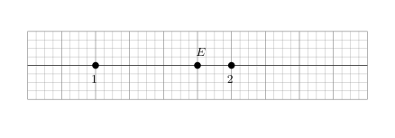
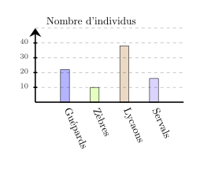
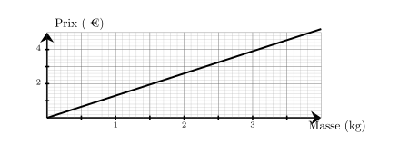
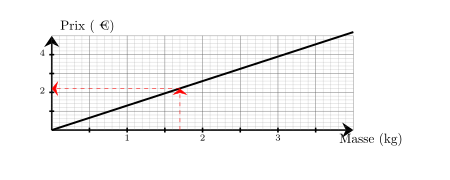
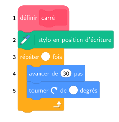




---Q---
Dans une association de 300 membres, $25\%$ des membres ont une taille supérieure à 1,75 m. 
    Combien de membres ont une taille supérieure à 1,75 m ?
---CORR---
Le nombre de membres qui ont une taille supérieure à 1,75 m est égal à : 
    $300 \times \dfrac{25}{100} = \dfrac{7\,500}{100}={\color{#8B3C52}\boldsymbol{75}}$.


---Q---
Sur chaque droite graduée, déterminer l’abscisse du point $E$.   <strong>A</strong>. $\dfrac{13}{8}$ &emsp;
    <strong>B</strong>. $\dfrac{17}{8}$ &emsp;
    <strong>C</strong>. $\dfrac{7}{4}$ &emsp;
    <strong>D</strong>. $\dfrac{3}{2}$ 
---CORR---
On remarque qu'il y a 4 divisions entre $1$ et $2$, donc chaque division vaut $\dfrac{1}{4}$. 
    Le point $E$ est situé après $7$ divisions à partir de l'origine. 
    Donc l'abscisse de $E$ est $\dfrac{7}{4}$. 
    Bonne réponse : C.


---Q---
Calculer l'aire d'un disque de rayon $2\text{ cm}$
---CORR---
$\mathcal{A}_\text{disque} = r \times r \times \pi$ $\mathcal{A}_\text{disque} = 2\text{ cm} \times 2\text{ cm} \times \pi$ $\mathcal{A}_\text{disque} = {\color{#8B3C52}\boldsymbol{4\pi}}\text{ cm}^2$


---Q---
Parmi les 4 réponses ci-dessous, une seule est correcte. 
Donner la lettre correspondante. Une voiture roule à $100$ km/h. Combien de temps met-elle pour parcourir $110$ km ?

     
      <strong>A</strong>. 1 h 06 min&emsp;&emsp; 
    <strong>B</strong>. 1 h 38 min 60 s&emsp;&emsp; 
    <strong>C</strong>. 33 min&emsp;&emsp; 
    <strong>D</strong>. 2 h 12 min
---CORR---
Pour parcourir $110$ km à $100$ km/h, il faut : 
    $\dfrac{110}{100}\text{h}=\dfrac{11}{10}\text{h}=\dfrac{10}{10}+\dfrac{1}{10}\text{h}=1+\dfrac{1}{10}\text{h}={\color{#8B3C52}\boldsymbol{1\mathbf{h }06\mathbf{ min}}}$. 
    La bonne réponse est la réponse A.






---Q---
Donner l'écriture décimale de $3{,}32 \times 10^{-1}$.
---CORR---
$3{,}32 \times 10^{-1} = {\color{#8B3C52}\mathbf{0{,}332}}$.


---Q---
Il est indiqué sur la bouteille de nettoyant pour sol qu'il faut  $48$ cL de  nettoyant pour sol pour $6$ L d'eau.  On veut utiliser $7$ L d'eau.  Quel volume de nettoyant pour sol doit-on prévoir ?
---CORR---
Commençons par trouver combien est-ce qu'il faut de nettoyant pour sol pour $1$ L d'eau.   6 L d'eau, c'est ${\color{#C5607A}\boldsymbol{6}}$ fois $1$ L d'eau. Pour $1$ L d'eau, il faut donc ${\color{#C5607A}\boldsymbol{6}}$ fois moins que $48$ cL. $48$ cL $\div {\color{#C5607A}\boldsymbol{6}} = 8$ cL   il faut ${\color{#C5607A}\boldsymbol{8}}$ cL de nettoyant pour sol pour $1$ L d'eau.   Cherchons maintenant la quantité nécessaire pour $7$ L d'eau.   $7$ L d'eau, c'est ${\color{#C5607A}\boldsymbol{7}}$ fois $1$ L d'eau. Il faut donc ${\color{#C5607A}\boldsymbol{7}}$ fois plus de nettoyant pour sol que $8$ cL :  ${\color{#C5607A}\boldsymbol{8}}$ cL $\times {\color{#C5607A}\boldsymbol{7}} = 56$ cL  il faut prévoir ${\color{#8B3C52}\boldsymbol{56}}$ cL de  nettoyant pour sol.


---Q---
Donner le nom de chacun des solides.   
---CORR---
Pyramide avec une base ayant $5$ sommets.


---Q---
Dans le parc naturel de Genser, il y a beaucoup d'animaux.  Voici un diagramme qui représente les effectifs de quelques espèces.

 

<strong>a.</strong>  Quelle est l'espèce la moins nombreuse ? 
    
    	$\square\;$ Servals&emsp;&emsp; $\square\;$ Lycaons&emsp;&emsp; $\square\;$ Guépards&emsp;&emsp; $\square\;$ Zèbres&emsp;&emsp;  
 <strong>b.</strong>  Quelle est l'espèce la plus nombreuse ? 
    
    	$\square\;$ Servals&emsp;&emsp; $\square\;$ Lycaons&emsp;&emsp; $\square\;$ Guépards&emsp;&emsp; $\square\;$ Zèbres&emsp;&emsp;  
 <strong>c.</strong>  L'espèce la plus nombreuse représente ... 
    
    	$\square\;$ Plus de la moitié des animaux&emsp;&emsp; $\square\;$ La moitié des animaux&emsp;&emsp; $\square\;$ Moins de la moitié des animaux&emsp;&emsp;   
---CORR---
<strong>a.</strong>  L'animal le moins nombreux parmi ces espèces est :  
    
    	$\square\;$ Servals&emsp;&emsp; $\square\;$ Lycaons&emsp;&emsp; $\square\;$ Guépards&emsp;&emsp; $\blacksquare\;$ Zèbres&emsp;&emsp;  
 <strong>b.</strong>  L'animal le plus nombreux parmi ces espèces est :  
    
    	$\square\;$ Servals&emsp;&emsp; $\blacksquare\;$ Lycaons&emsp;&emsp; $\square\;$ Guépards&emsp;&emsp; $\square\;$ Zèbres&emsp;&emsp;  
 <strong>c.</strong>  L'animal le plus nombreux parmi ces espèces représente :  
    
    	$\square\;$ Plus de la moitié des animaux&emsp;&emsp; $\square\;$ La moitié des animaux&emsp;&emsp; $\blacksquare\;$ Moins de la moitié des animaux&emsp;&emsp;  






---Q---
Compléter le tableau en mettant oui ou non dans chaque case. $$\begin{array}{|l|c|c|c|c|}
    \hline
    \text{... est divisible} & \text{par }2 & \text{par }3 & \text{par }5 & \text{par }9\\
    \hline
    4\,626 & & & & \\
    \hline
    \end{array}$$
---CORR---
$$\begin{array}{|l|c|c|c|c|}
    \hline
    \text{... est divisible} & \text{par }2 & \text{par }3 & \text{par }5 & \text{par }9\\
    \hline
    4\,626 & \color{blue}{\text{oui}} & \color{blue}{\text{oui}} & \text{non} & \color{blue}{\text{oui}} \\
    \hline
    \end{array}$$


---Q---
Sur le graphique ci-dessus, on a représenté le prix en euros en fonction de la masse en kilogrammes de bananes achetés. Quel est le prix à payer pour l'achat de $1{,}7$ kg de bananes ? 
---CORR---
Le prix à payer pour l'achat de $1{,}7$ kg de bananes est de ${\color{#8B3C52}\boldsymbol{2{,}20}}$ €. 


---Q---
$1$ $\ldots$ = $24$ heures
---CORR---
$1$ jour = $24$ heures


---Q---
Une élève souhaite réaliser un programme pour dessiner un carré.  
    Par quelles valeurs doit-elle compléter les lignes 3 et 5 ? 
---CORR---
Pour obtenir un carré, il faut répéter ${\color{#8B3C52}\mathbf{4}}$ fois  
    et tourner de $\dfrac{360}{4} = {\color{#8B3C52}\mathbf{90}}$ degrés.



