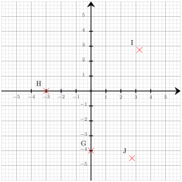




---Q---
Simplifier le plus possible la fraction suivante  $\dfrac{21}{14}$
---CORR---
$\dfrac{21}{14}=\dfrac{3\times\cancel{7}}{2\times\cancel{7}}={\color{#8B3C52}\boldsymbol{\dfrac{3}{2}}}$


---Q---
$b$ étant un nombre entier, exprimer l'entier suivant en fonction de $b$.
---CORR---
Le successeur de $b$ peut se noter : ${\color{#8B3C52}\boldsymbol{b+1}}$ ou ${\color{#8B3C52}\boldsymbol{1+b}}$.


---Q---
Déterminer les coordonnées respectives des points $H$, $I$, $G$ et $J$  
---CORR---
Les coordonnées respectives des points sont :  $H({\color{#8B3C52}\boldsymbol{-3}};{\color{#8B3C52}\boldsymbol{0}})$, $I({\color{#8B3C52}\boldsymbol{3{,}25}};{\color{#8B3C52}\boldsymbol{2{,}75}})$, $G({\color{#8B3C52}\boldsymbol{0}};{\color{#8B3C52}\boldsymbol{-4}})$ et $J({\color{#8B3C52}\boldsymbol{2{,}75}};{\color{#8B3C52}\boldsymbol{-4{,}5}})$


---Q---
$MNO$ est un triangle rectangle en $M$ dans lequel
      $MN=2$ et $MO=\sqrt{8}$. 
       Calculer la valeur exacte de $NO$ .
---CORR---
On utilise le théorème de Pythagore dans le triangle $MNO$,  rectangle en $M$. 
On obtient : 
$\begin{aligned}
NO^2&=MN^2+MO^2\\
NO^2&=\sqrt{8}^2+2^2\\
NO^2&=8+4\\
NO^2&=12\\
NO&={\color{#8B3C52}\boldsymbol{\sqrt{12}}}
\end{aligned}$







---Q---
Calculer. $ (+6)  \times (-4)$
---CORR---
$ {\color{blue}\boldsymbol{(+6)}} \times {\color{#A4485F}\boldsymbol{(-4)}}  = {\color{#8B3C52}\boldsymbol{(-24)}} $


---Q---
Résoudre les équations suivantes. $-5a+4=6$
---CORR---
$-5a+4=6$ On soustrait $4$ aux deux membres. $-5a+4{\color{#C5607A}\boldsymbol{\,\,-\,\,4}}=6{\color{#C5607A}\boldsymbol{\,\,-\,\,4}}$ $-5a=2$ On divise les deux membres par $-5$. $-5a{\color{#C5607A}\boldsymbol{\,\div\,(-5)}}=2{\color{#C5607A}\boldsymbol{\,\div\,(-5)}}$ $a=-\dfrac{2}{5}$  La solution de l'équation $-5a+4=6$ est ${\color{#8B3C52}\boldsymbol{-\dfrac{2}{5}}}$.


---Q---
$EXW$ est un triangle rectangle en $X$ et l'angle $\widehat{XEW}$ mesure $49^\circ$. Quelle est la mesure de l'angle $\widehat{XWE}$ ?
---CORR---
Le triangle $EXW$ étant rectangle en $X$, les angles $\widehat{XEW}$ et $\widehat{XWE}$ sont complémentaires (leur somme est égale à $90^\circ$). D'où : $\widehat{XWE}+ \widehat{XEW}=90^\circ$ D'où : $\widehat{XWE}=90^\circ-49^\circ=41^\circ$ L'angle ${\color{black}\boldsymbol{\widehat{XWE}}}$ mesure ${\color{#8B3C52}\boldsymbol{41}}^\circ$. 


---Q---
 
Sur la figure ci-dessus, dans le triangle $RPA$, les droites $(PA)$ et $(SL)$ sont parallèles. Déterminer la longueur $RP$. 
---CORR---
Dans le triangle $RPA$, les droites $(PA)$ et $(SL)$ sont parallèles.  
    D'après le théorème de Thalès, on a :  
    $\dfrac{RP}{RL} =
    \dfrac{PA}{SL}$.  
    En remplaçant par les longueurs, on obtient :  
    $\dfrac{RP}{RL} = \dfrac{10}{4}=2{,}5$. 
    On en déduit que :  
    $RP = 2{,}5 \times 8 = {\color{#8B3C52}\boldsymbol{20}}$ cm.






---Q---
Depuis 2025 le nombre d'élèves d'un collège a augmenté de $15\,\%$. Il y a maintenant $1\,357$ élèves. Calculer le nombre d'élèves en 2025 dans cet établissement.
---CORR---
Une augmentation de $15\,\%$ revient à multiplier par $100\,\% + 15\,\% = 115\,\% = 1{,}15$. Pour retrouver le nombre initial d'élèves, on va donc diviser le nombre actuel d'élèves par $1{,}15$. $1\,357\div 1{,}15 = 1\,180$ En 2025, il y avait ${\color{#8B3C52}\boldsymbol{1\,180}}$ élèves dans ce collège.


---Q---
Lire l'abscisse de chacun des points suivants. 
---CORR---
 


---Q---
Calculer le périmètre du octogone régulier $ABCDEFGH$ représenté ci-dessous : 
---CORR---
	Le polygone a $8$ côtés de longueur $7{,}5$ cm. 
Le périmètre est donc égal à : 
$8 \times 7{,}5 = {\color{#8B3C52}\boldsymbol{60}}$ cm.


---Q---
Dans le triangle $SNZ$, rectangle en $N$, quel calcul doit-on effectuer pour déterminer le cosinus de l’angle $\widehat{NSZ}$ ? 
---CORR---
La bonne formule est :  
    $\text{cosinus}(\widehat{NSZ}) = \dfrac{\text{longueur du côté adjacent à l’angle } \widehat{NSZ}}{\text{longueur de l’hypoténuse }}=\dfrac{SN}{SZ}$.



