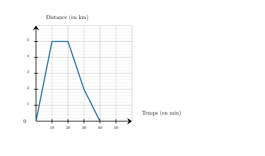
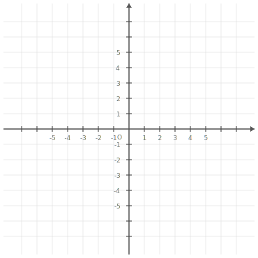
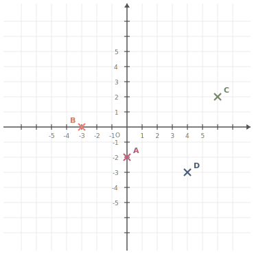
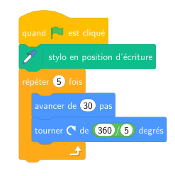
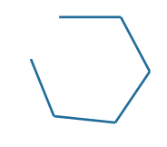
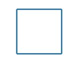




---Q---
Donner l'écriture scientifique de $-0{,}502$$\,=$$\,\dots$
---CORR---
$-0{,}502 = {\color{#8B3C52}\boldsymbol{-5{,}02\times 10^{-1}}}$


---Q---
Un camion parcourt en moyenne $442{,}8\text{ km}$ en $3$ heures.
    Quelle distance va-t-il parcourir, à la même vitesse, en $10$ heures ?
---CORR---
Commençons par trouver quelle est la distance parcourue en 1h.  
  $1$ h, c'est ${\color{#C5607A}\boldsymbol{3}}$ fois moins que $3$ h.
   En $1$ h, le camion parcourt donc une distance ${\color{#C5607A}\boldsymbol{3}}$ fois moins grande qu'en $3$ h. $442{,}8\text{ km} \div {\color{#C5607A}\boldsymbol{3}} = 147{,}6 \text{ km}$   en 1h, le camion parcourt ${\color{#C5607A}\boldsymbol{147{,}6}}\text{ km}$.   Cherchons maintenant la distance parcourue en $10$ h.   $10$ h, c'est ${\color{#C5607A}\boldsymbol{10}}$ fois $1$ h. Le camion parcourt donc ${\color{#C5607A}\boldsymbol{10}}$ fois plus de distance qu'en $1$ h.  ${\color{#C5607A}\boldsymbol{147{,}6}}\text{ km} \times {\color{#C5607A}\boldsymbol{10}} = 1\,476\text{ km}$   le camion parcourra en moyenne ${\color{#8B3C52}\boldsymbol{1\,476}}\text{ km}$ en $10$ h.


---Q---
Calculer le volume d'une pyramide de hauteur $5\text{ m}$ et dont la base  est un carré de $9\text{ dm}$  de côté.
---CORR---
$\mathcal{V}=\dfrac{1}{3} \times \mathcal{B} \times h=\dfrac{1}{3}\times\left(9\text{ dm}\right)^2\times5\text{ m}=\dfrac{1}{3}\times81\text{ dm}^2\times50\text{ dm}={\color{#8B3C52}\boldsymbol{1\,350\mathbf{ dm}^3}}$


---Q---
Wendy vient d'avoir 10 ans cette année. Son père Victor vient de fêter  son 39ème anniversaire. L'âge de son père est-il proportionnel à l'âge de Wendy ? 
---CORR---
Aujourd'hui, la différence d'âge entre Wendy et Victor est de 29 ans. Wendy a 10 ans aujourd'hui. Dans 10 années, Wendy aura 20 ans (10 + 10), c'est-à-dire le double d'aujourd'hui. Son père Victor qui a actuellement 39 ans aura 49 ans cette année-là (39+10). Quand l'âge de Wendy double, l'âge de Victor ne double pas, donc l'âge de Wendy et l'âge de son père ne sont pas propotionnels. Dans 10 années, la différence d'âge restera la même : 49 - 20 = 29.






---Q---
Quel est le carré de $16$ ?
---CORR---
Le carré d'un nombre est ce nombre multiplié par lui-même : $16\times16=256$


---Q---
Léa fait du vélo avec son smartphone sur une voie-verte rectiligne qui part de chez elle. Une application lui permet de voir à quelle distance de chez elle, elle se trouve. 

À l'aide de ce graphique, répondre aux questions suivantes :

 
$\mathbf{a)}$ Que se passe-t-il après 10 minutes de vélo ?

 
$\mathbf{b)}$ Pendant combien de temps, Léa, a-t-elle fait réellement du vélo ? 

 
$\mathbf{c)}$ Quelle distance a-t-elle parcourue au total ? 
---CORR---
<strong>a.</strong>  Après 10 minutes de vélo, Léa fait une pause car la courbe devient horizontale. 
            <strong>b.</strong>  Léa est partie 40 min et a fait une pause de 10 min donc elle a fait réellement du vélo pendant ${\color{#8B3C52}\boldsymbol{30\,\mathbf{min}}}$. 
              <strong>c.</strong>  Le point le plus loin de sa maison est à 5 $\text{km}$ et ensuite elle revient chez elle, donc la distance totale est de ${\color{#8B3C52}\boldsymbol{10\,\mathbf{km}}}$.


---Q---
$1$ jour = $\ldots$ heures
---CORR---
$1$ jour = ${\color{#8B3C52}\boldsymbol{24}}$ heures


---Q---
Plusieurs amis reviennent du marché.  
    Il s'agit de Pablo, Océane et Hugo.   

    Pablo rapporte $8$ coings, $4$ pommes, $1$ pêche et $8$ bananes.   
    Océane rapporte $8$ coings, $4$ bananes, $9$ pommes et $10$ pêches.   
    Hugo rapporte $1$ pêche, $4$ coings, $8$ pommes et $9$ bananes. 

     
    <strong>a.</strong> Compléter le tableau.   
    <strong>b.</strong> Quel est le nombre total de fruits achetés ?   
    <strong>c.</strong> Qui a rapporté le plus de fruits ?   
    <strong>d.</strong> Quel fruit a été rapporté en la plus grande quantité ? 

    

$$
    
    \begin{array}{|c|c|c|c|c|c|}
    \hline
      \text{Amis\textbackslash fruits} &
      \text{Pomme} &
      \text{Banane} &
      \text{Pêche} &
      \text{Coing} &
      \text{TOTAL}\\
    \hline
      \text{Pablo} & & & & & \\
    \hline
      \text{Océane} & & & & & \\
    \hline
      \text{Hugo} & & & & & \\
    \hline
      \text{TOTAL} & & & & & \\
    \hline
    \end{array}
    
    $$
---CORR---
<strong>a.</strong> Tableau complété :

    

$$
    
    \begin{array}{|c|c|c|c|c|c|}
    \hline
      \text{Amis\textbackslash fruits} &
      \text{Pomme} &
      \text{Banane} &
      \text{Pêche} &
      \text{Coing} &
      \text{TOTAL}\\
    \hline
      \text{Pablo} & 4 & 8 & 1 & 8 & 21\\
    \hline
      \text{Océane} & 9 & 4 & 10 & 8 & 31\\
    \hline
      \text{Hugo} & 8 & 9 & 1 & 4 & 22\\
    \hline
      \text{TOTAL} & 21 & 21 & 12 & 20 & 74\\
    \hline
    \end{array}
    
    $$

<strong>b.</strong> Total de fruits : 74.   
<strong>c.</strong> Celui qui a rapporté le plus de fruits : Océane (31 fruits).   
<strong>d.</strong> Fruits les plus rapportés : pommes et bananes (21 chacun).






---Q---
Effectuer le calcul suivant en donnant le résultat sous forme d'une fraction. $C = \dfrac{6}{8} + 4 $
---CORR---
$C = \dfrac{6}{8}+4$  
$C = \dfrac{6}{8}+\dfrac{32}{8}$  
$C = \dfrac{38}{8}$  
$C  =\dfrac{19{\color{blue}\boldsymbol{\times2}}}{4{\color{blue}\boldsymbol{\times2}}}={\color{#8B3C52}\boldsymbol{\dfrac{19}{4}}}$ 


---Q---
Réduire cette expression, si cela est possible : $D=-1\times 9x$
---CORR---
$D = -1\times 9x$ $D = {\color{#8B3C52}\boldsymbol{-9x}}$ 


---Q---
Placer les points suivants : $A(0\;;\;-2)$ ; $B(-3\;;\;0)$ ; $C(6\;;\;2)$ et $D(4\;;\;-3)$.

      
---CORR---
Les points sont placés aux coordonnées indiquées : 


---Q---
Laquelle des 4 figures ci-dessous va être tracée avec le script fourni ?  

  

    
    
Figure A

  

  

    
    
Figure B

  

  

    
    
Figure C

  

  

    
    
Figure D

  

---CORR---
Voir la figure correspondant au code Scratch.



