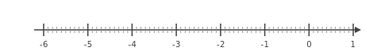
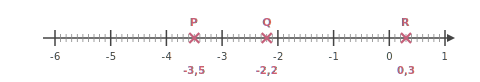
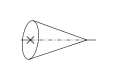




---Q---
Compléter avec le signe < ou >. $4{,}711 \quad \ldots\ldots   \quad-4{,}465$
---CORR---
$4{,}711 \quad {\color{#F15929}\boldsymbol{>}} \quad -4{,}465$


---Q---
Choisis le calcul qui permet de résoudre l'équation suivante :  
Pour résoudre $5x-7=13$ :

      <strong>A</strong>. $\dfrac{13+7}{5}$&emsp;&emsp; 
    <strong>B</strong>. $13\times 5+7$&emsp;&emsp; 
    <strong>C</strong>. $\dfrac{13}{5}+7$&emsp;&emsp; 
    <strong>D</strong>. $(13-5)+7$
---CORR---
$5x-7=13$   
    On ajoute $7$ : $5x=13+7$.   
    Puis on divise par $5$ : $x=\dfrac{13+7}{5}$.   
    Bonne réponse : <strong>A</strong>.


---Q---
À l'aide du schéma ci-dessous, déterminer : - deux segments de même longueur ; - le milieu d'un segment ; - un triangle rectangle ; - un triangle isocèle.   
---CORR---
- Deux segments de même mesure : [$GI$] et $[IH]$ ou $[GK]$ et $[KH]$ ou $[JF]$ et $[FH]$. - $I$ est le milieu du segment $[GH]$. - $GJH$ est un triangle rectangle en $G$, $GIK$ est un triangle rectangle en $I$ et $HIK$ est un triangle rectangle en $I$. - $GKH$ est un triangle isocèle en $K$ et $JFH$ est un triangle isocèle en $F$. 


---Q---
Déterminer la valeur exacte de $JK$.  
---CORR---
On utilise le théorème de Pythagore dans le triangle $IJK$,  rectangle en $J$. 
      On obtient :

 

      $\begin{aligned}
        IJ^2+JK^2&=IK^2\\
        JK^2&=IK^2-IJ^2\\
        JK^2&=10^2-2^2\\
        JK^2&=100-4\\
        JK^2&=96\\
        JK&={\color{#F15929}\boldsymbol{\sqrt{96}}}
        \end{aligned}$






---Q---
Déterminer la valeur de $25\,\%$ de $89$.
---CORR---
$25\,\%$ de $89$ :  
    $\dfrac{25 \times 89}{100} = 0{,}25 \times 89 = 22{,}25$.  
    Donc la valeur est 22.


---Q---
Placer les points : $P(-3{,}5), Q(-2{,}2), R(0{,}3)$.

  
---CORR---



---Q---
Calculer le périmètre exact des figures suivantes. Cercle de rayon $4\text{ cm}$
---CORR---
$\mathcal{P}_\text{cercle} = 2 \times r \times \pi$ $\mathcal{P}_\text{cercle} = 2 \times 4\text{ cm} \times \pi$ $\mathcal{P}_\text{cercle} = {\color{#F15929}\boldsymbol{8\pi}}\text{ cm}$


---Q---
Sur la figure suivante : 
          $\leadsto M$ est sur $[LJ]$,
          $\leadsto N$ est sur $[LK]$,  $\leadsto$ les droites $(JK)$ et $(MN)$ sont parallèles. Écrire la double égalité de Thalès.  
---CORR---
Dans le triangle $JKL$ :
         $\leadsto$ $M\in[LJ]$,
         $\leadsto$ $N\in[LK]$,
         $\leadsto$  $(JK)//(MN)$,
         donc d'après le théorème de Thalès, les triangles $JKL$ et $MNL$ ont des longueurs proportionnelles.

 
$\dfrac{LM}{LJ}=\dfrac{LN}{LK}=\dfrac{MN}{JK}$  <strong>Remarque</strong> On pourrait aussi écrire : $\dfrac{LJ}{LM}=\dfrac{LK}{LN}=\dfrac{JK}{MN}$






---Q---
Donner l'écriture décimale de $9{,}1 \times 10^{3}$.
---CORR---
$9{,}1 \times 10^{3} = {\color{#F15929}\mathbf{9\,100}}$.


---Q---
Sur une carte sur laquelle $3\text{ cm}$ représente $14{,}4\text{ km}$ dans la réalité,  
  Wendy mesure son trajet et elle trouve une distance de $10\text{ cm}$.  À quelle distance cela correspond dans la réalité ?
---CORR---
Commençons par trouver à combien de $\text{km}$ dans la réalité, $1\text{ cm}$ sur la carte correspond.  
  $1\text{ cm}$, c'est ${\color{#216D9A}\boldsymbol{3}}$ fois moins que $3\text{ cm}$. $14{,}4\text{ km}\div {\color{#216D9A}\boldsymbol{3}} = 4{,}8\text{ km}$   $1\text{ cm}$ sur la carte correspond donc à ${\color{#216D9A}\boldsymbol{4{,}8}}\text{ km}$ dans la réalité.   Cherchons maintenant la distance réelle de son trajet.   $10\text{ cm}$, c'est ${\color{#216D9A}\boldsymbol{10}}$ fois $1\text{ cm}$.  ${\color{#216D9A}\boldsymbol{4{,}8}}\text{ km}\times {\color{#216D9A}\boldsymbol{10}} = 48\text{ km}$  son trajet correspond en réalité à une distance de ${\color{#F15929}\boldsymbol{48}}\text{ km}$.


---Q---
Donner le nom de chacun des solides.   
---CORR---
Cône de révolution


---Q---
Dans le triangle $HIJ$ rectangle en $H$,  $HI=7\text{ cm}$ et $\widehat{HIJ}=49^\circ$. Calculer $IJ$ à $0,1\text{ cm}$ près.   
---CORR---
Dans le triangle $HIJ$ rectangle en $H$,  le cosinus de l'angle $\widehat{HIJ}$ est défini par : $\cos\left(\widehat{HIJ}\right)=\dfrac{HI}{IJ}$. Avec les données numériques : $\dfrac{\cos\left(49^\circ\right)}{\color{red}{1}}=\dfrac{7}{IJ}$  $IJ=\dfrac{7 \times\color{red}{1}}{\cos\left(49^\circ\right)}$ soit $IJ\approx{\color{#F15929}\boldsymbol{10{,}7}}\text{ cm}$.



