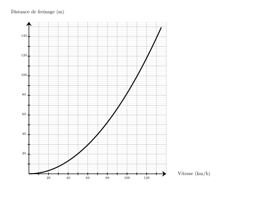
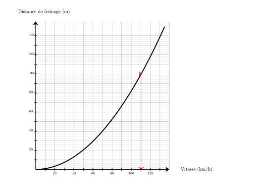
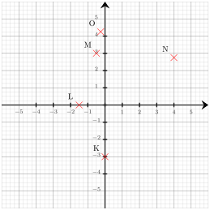
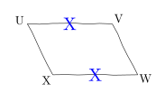
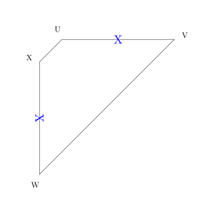




---Q---
Calculer le carré de $11$
---CORR---
$11^2={\color{#F15929}\boldsymbol{121}}$


---Q---
Une voiture freine sur une route sèche et parcourt $100\text{ m}$. 
    En utilisant le graphique ci-dessous, dire à quelle vitesse elle roulait ? 
---CORR---
Pour une distance de freinage de $100\text{ m}$, la vitesse est d'environ ${\color{#F15929}\boldsymbol{110}}\text{ km/h}$. 


---Q---
Convertir $153$ minutes en heures ($\text{h}$) et minutes ($\text{min}$).
---CORR---
Mentalement :  
On cherche le multiple de $60$ inférieur à $153$ le plus grand possible. C'est $2\times 60 = 120$. 
Ainsi $153 = 120 + 33$ donc $153\text{\,min\,}= 2\text{\,h\,}33\text{\,min}$. $153 = (2 \times 60) + 33$ donc $153$ minutes = ${\color{#F15929}\boldsymbol{2\,\mathbf{h}\,33\,\mathbf{min}}}$.


---Q---
On tire une boule au hasard dans une urne contenant $7$ boules noires et $7$ boules blanches.              Quelle est la probabilité d'obtenir une boule noire ?               On donnera le résultat sous forme d'une fraction irréductible.
---CORR---
Dans une situation d'équiprobabilité,
        on calcule la probabilité d'un événement par le quotient :
        $\dfrac{\text{Nombre d'issues favorables}}{\text{Nombre total d'issue}}$.  
        La probabilité est donc donnée par : 
        $\dfrac{\text{Nombre de boules noires}}{\text{Nombre total de boules}}
             =\dfrac{7}{14}  =\dfrac{1{\color{#2563a5}\boldsymbol{\times7}} }{2{\color{#2563a5}\boldsymbol{\times7}}}={\color{#F15929}\boldsymbol{\dfrac{1}{2}}}$






---Q---
Combien valent les trois quarts de $20$ ?
---CORR---
Un quart de $20$ est égal à $20 \div 4$, soit 5. 
        Donc les trois quarts de $20$ valent $3 \times 5 = 15$.


---Q---
Calculer $B = x^2 + 6x$, pour $x = 10$.
---CORR---
$B = 10 \times 10 + 6 \times 10$ $B = 100 + 60$ $B = {\color{#F15929}\boldsymbol{160}}$


---Q---
Déterminer les coordonnées respectives des points $N$, $O$, $L$, $K$ et $M$  
---CORR---
Les coordonnées respectives des points sont :  $N({\color{#F15929}\boldsymbol{4}};{\color{#F15929}\boldsymbol{2{,}75}})$, $O({\color{#F15929}\boldsymbol{-0{,}25}};{\color{#F15929}\boldsymbol{4{,}25}})$, $L({\color{#F15929}\boldsymbol{-1{,}5}};{\color{#F15929}\boldsymbol{0}})$, $K({\color{#F15929}\boldsymbol{0}};{\color{#F15929}\boldsymbol{-3}})$ et $M({\color{#F15929}\boldsymbol{-0{,}5}};{\color{#F15929}\boldsymbol{3}})$


---Q---
Déterminer la moyenne, de cette série de note :
Voici une série de 4 notes : $5, 6, 14, 5$.   
    Quelle est la moyenne de cette série ?

     
      <strong>A</strong>. $8{,}5$ &emsp;
    <strong>B</strong>. $7{,}5$ &emsp;
    <strong>C</strong>. $7$ &emsp;
    <strong>D</strong>. $6$
---CORR---
La moyenne de cette série est :
    

$$
    \frac{5+6+14+5}{4}=\frac{30}{4}=7{,}5.
    $$

    Bonne réponse : B.






---Q---
Calculer. $ (-4) - (-2) $
---CORR---
$  {\color{#008002}\boldsymbol{(-4)}} - {\color{#008002}\boldsymbol{(-2)}} = {\color{#f15929}\boldsymbol{(-2)}} $


---Q---
Résoudre les équations suivantes. $\dfrac{4z}{5}=-5$
---CORR---
$\dfrac{4z}{5}=-5$ On multiplie les deux membres par $\dfrac{5}{4}$. $\dfrac{4z}{5}{\color{#216D9A}\boldsymbol{\,\times\,\dfrac{5}{4}}}=-5{\color{#216D9A}\boldsymbol{\,\times\,\dfrac{5}{4}}}$ $z=\dfrac{-25}{4}$  La solution de l'équation $\dfrac{4z}{5}=-5$ est ${\color{#F15929}\boldsymbol{-\dfrac{25}{4}}}$.


---Q---
Préciser s'il s'agit d'un parallélogramme.  
---CORR---
Seulement deux côtés opposés sont de même longueur, ${\color{#F15929}\boldsymbol{UVWX}}$ n'est donc pas forcément un parallélogramme comme le montre le contre-exemple suivant.  


---Q---
On considère l’algorithme suivant :

    

    Qu’obtient‑on si on choisit $2$ comme nombre de départ ? 
---CORR---
Si on choisit $2$ comme nombre de départ, alors variable prend la valeur $2$. 
    Ensuite, resultat prend la valeur $4 \times 2 = 8$. 
    Puis, resultat prend la valeur $8 + 16 = 24$. 
    Enfin, resultat prend la valeur $\dfrac{24}{4} = 6$. 
    Résultat final : ${\color{#F15929}\mathbf{6}}$.



