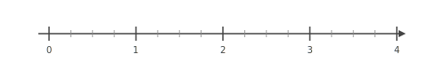
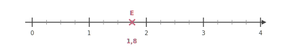
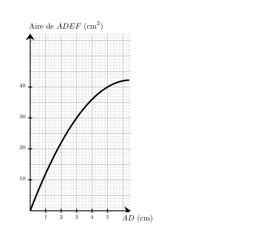
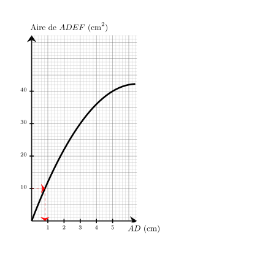




---Q---
Dans une association, $40\%$ des 150 membres participent à une collecte de fonds. 
    Combien de membres ne participent pas à cette collecte ?
---CORR---
Le nombre de membres participant à cette collecte est égal à : 
    $150 \times \dfrac{40}{100} = 60$. 
    Le nombre de membres ne participant pas à cette collecte est donc égal à : 
    $150 - 60 = {\color{#8B3C52}\boldsymbol{90}}$. 

 
Une autre méthode consiste à calculer le pourcentage de membres ne participant pas à cette collecte, qui est égal à $100\% - 40\% = 60\%$. 
    Le nombre de membres ne participant pas à cette collecte est donc égal à : 
    $150 \times \dfrac{60}{100} = {\color{#8B3C52}\boldsymbol{90}}$.


---Q---
Sur cette droite graduée, quelle est l'abscisse du point $E$ ?  <strong>A</strong>. $\dfrac{13}{8}$ &emsp; <strong>B</strong>. $\dfrac{7}{4}$ &emsp; <strong>C</strong>. $\dfrac{17}{8}$ &emsp; <strong>D</strong>. $\dfrac{3}{2}$
---CORR---
 On remarque qu'il y a $4$ divisions entre $1$ et $2$, donc chaque graduation vaut $\dfrac{1}{4}$. Le point $E$ est situé à $1 + \dfrac{3}{4} = \dfrac{7}{4}$ depuis l'origine. La bonne réponse est <strong>B</strong>. $\dfrac{7}{4}$


---Q---
Calculer l'aire exacte de la figure suivante. Triangle de base $4\text{ cm}$ et de hauteur $5\text{ cm}$
---CORR---
$\mathcal{A}_\text{triangle} = (b \times h) \div 2$ $\mathcal{A}_\text{triangle} = (4\text{ cm} \times 5\text{ cm}) \div 2$ $\mathcal{A}_\text{triangle} = 20\text{ cm}^2 \div 2$ $\mathcal{A}_\text{triangle} = {\color{#8B3C52}\boldsymbol{10}}\text{ cm}^2$


---Q---
$KLM$ est un triangle rectangle en $K$ dans lequel
      $KL=7$ et $KM=\sqrt{7}$.
---CORR---
On utilise le théorème de Pythagore dans le triangle $KLM$,  rectangle en $K$. 
On obtient : 
$\begin{aligned}
LM^2&=KL^2+KM^2\\
LM^2&=\sqrt{7}^2+7^2\\
LM^2&=7+49\\
LM^2&=56\\
LM&={\color{#8B3C52}\boldsymbol{\sqrt{56}}}
\end{aligned}$







---Q---
Donner l'écriture scientifique de $9\,000$$\,=$$\,\dots$
---CORR---
$9\,000 = {\color{#8B3C52}\boldsymbol{9\times 10^{3}}}$


---Q---
Zoé a repéré, dans la boutique du musée, des puzzles qui l'intéressent. 
  Elle lit que $11$ puzzles coûtent $148{,}50$ €. Elle veut en acheter $12$. 
  Combien va-t-elle dépenser ?
---CORR---
Commençons par trouver le prix d'un seul puzzle.  
Si $11$ puzzles coûtent $148{,}50$ €, alors un seul puzzle coûte ${\color{#C5607A}\boldsymbol{11}}$ fois moins cher. 
$148{,}50$ €&nbsp;$ \div {\color{#C5607A}\boldsymbol{11}} = 13{,}50 $ €&nbsp; 

un seul puzzle coûte ${\color{#C5607A}\boldsymbol{13{,}50}}$ €. 
Cherchons maintenant le prix de $12$ puzzles.  
$12$ puzzles, c'est ${\color{#C5607A}\boldsymbol{12}}$ fois plus qu'un seul puzzle.  
$12$ puzzles coûtent donc ${\color{#C5607A}\boldsymbol{12}}$ fois plus que ${\color{#C5607A}\boldsymbol{13{,}50}}$ €, le prix d'un seul puzzle.  ${\color{#C5607A}\boldsymbol{13{,}50}}$ € &nbsp;$\times {\color{#C5607A}\boldsymbol{12}} = 162$ €   
$12$ puzzles coûtent ${\color{#8B3C52}\boldsymbol{162}}$ €.


---Q---
Calculer le volume, arrondi au $\text{ cm}^3$ près, d'un cylindre de $8\text{ cm}$ de rayon et de $6{,}8\text{ dm}$ de hauteur.
---CORR---
$\mathcal{V}=\pi \times R ^2 \times h =\pi\times\left(8\text{ cm}\right)^2\times6{,}8\text{ dm}=\pi\times64\text{ cm}^2\times68\text{ cm}=4\,352\pi\text{ cm}^3\approx{\color{#8B3C52}\boldsymbol{13\,672\mathbf{ cm}^3}}$


---Q---
 
Sur la figure ci-dessus, dans le triangle $DFJ$, les droites $(FJ)$ et $(TH)$ sont parallèles. Déterminer la longueur $DF$. 
---CORR---
Dans le triangle $DFJ$, les droites $(FJ)$ et $(TH)$ sont parallèles.  
    D'après le théorème de Thalès, on a :  
    $\dfrac{DF}{DH} =
    \dfrac{FJ}{TH}$.  
    En remplaçant par les longueurs, on obtient :  
    $\dfrac{DF}{DH} = \dfrac{28}{8}=3{,}5$. 
    On en déduit que :  
    $DF = 3{,}5 \times 24 = {\color{#8B3C52}\boldsymbol{84}}$ cm.






---Q---
Compléter le tableau en mettant oui ou non dans chaque case. $$\begin{array}{|l|c|c|c|c|}
    \hline
    \text{... est divisible} & \text{par }2 & \text{par }3 & \text{par }5 & \text{par }9\\
    \hline
    2\,034 & & & & \\
    \hline
    \end{array}$$
---CORR---
$$\begin{array}{|l|c|c|c|c|}
    \hline
    \text{... est divisible} & \text{par }2 & \text{par }3 & \text{par }5 & \text{par }9\\
    \hline
    2\,034 & \color{blue}{\text{oui}} & \color{blue}{\text{oui}} & \text{non} & \color{blue}{\text{oui}} \\
    \hline
    \end{array}$$


---Q---
Sur le graphique ci-dessus, on a représenté la relation entre la longueur $AD$ et l'aire du rectangle $ADEF$. Quelle est la longueur $AD$ lorsque l'aire du rectangle $ADEF$ vaut $10\text{ cm}^2$ ? 
---CORR---
On cherche $AD$ tel que $Aire_{ADEF} = 10\text{ cm}^2$. 
      On trouve $AD={\color{#8B3C52}\boldsymbol{0{,}8}}\text{ cm}$. 


---Q---
Un concours dure $430$ minutes. Quelle est sa durée en heures et minutes ?
---CORR---
Une heure contient 60 minutes.  
    $430=420+10=7\times 60+10$, donc dans $430$ minutes il y a 7 h 10 min.


---Q---
Exprimer $\cos(\widehat{NLK})$ de deux manières :  
    

$$
    \cos(\widehat{NLK})=\dfrac{\ldots}{\ldots}
    \qquad\text{et}\qquad
    \cos(\widehat{NLK})=\dfrac{\ldots}{\ldots}
    $$ 
---CORR---
$NLK$ est rectangle en $N$ donc :
    

$$
    \cos\left(\widehat{NLK}\right)
    = {\color{#8B3C52}\mathbf{\dfrac{NL}{LK}}}.
    $$

    $NLM$ est rectangle en $M$ donc :
    

$$
    \cos\left(\widehat{NLK}\right)
    = {\color{#8B3C52}\mathbf{\dfrac{LM}{NL}}}.
    $$



