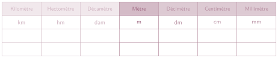
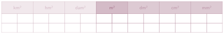
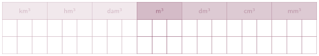






---INTRO---
Compléter.
---Q---
$0{,}28\,\text{dm}^3=$$\text{L}$
---CORR---
$1~\text{dm}^3 = 1~\text{L}$, les deux écritures désignent la même quantité : $0{,}28~\text{dm}^3 = {\color{#EB7F73}\boldsymbol{0{,}28~\text{L}}}$
---Q---
$5{,}6\,\text{L}=$$\text{dm}^3$
---CORR---
$1~\text{dm}^3 = 1~\text{L}$, les deux écritures désignent la même quantité : $5{,}6~\text{L} = {\color{#EB7F73}\boldsymbol{5{,}6~\text{dm}^3}}$
---Q---
$90{,}8\,\text{cm}^3=$$\text{L}$
---CORR---
$1~\text{dm}^3 = 1~\text{L}$. On divise par $10^{3}$ : $90{,}8~\text{cm}^3 = {\color{#EB7F73}\boldsymbol{0{,}090\,8~\text{L}}}$
---Q---
$0{,}4\,\text{m}^3=$$\text{L}$
---CORR---
$1~\text{dm}^3 = 1~\text{L}$. On multiplie par $10^{3}$ : $0{,}4~\text{m}^3 = {\color{#EB7F73}\boldsymbol{400~\text{L}}}$
---Q---
$0{,}6\,\text{L}=$$\text{m}^3$
---CORR---
$1~\text{dm}^3 = 1~\text{L}$. On divise par $10^{3}$ : $0{,}6~\text{L} = {\color{#EB7F73}\boldsymbol{0{,}000\,6~\text{m}^3}}$
---Q---
$0{,}96\,\text{mm}^3=$$\text{L}$
---CORR---
$1~\text{dm}^3 = 1~\text{L}$. On divise par $10^{6}$ : $0{,}96~\text{mm}^3 = {\color{#EB7F73}\boldsymbol{0{,}000\,000\,96~\text{L}}}$
---Q---
$9{,}5\,\text{dam}^3=$$\text{L}$
---CORR---
$1~\text{dm}^3 = 1~\text{L}$. On multiplie par $10^{6}$ : $9{,}5~\text{dam}^3 = {\color{#EB7F73}\boldsymbol{9\,500\,000~\text{L}}}$
---Q---
$90{,}6\,\text{L}=$$\text{cm}^3$
---CORR---
$1~\text{dm}^3 = 1~\text{L}$. On multiplie par $10^{3}$ : $90{,}6~\text{L} = {\color{#EB7F73}\boldsymbol{90\,600~\text{cm}^3}}$
---Q---
$0{,}3\,\text{m}^3=$$\text{L}$
---CORR---
$1~\text{dm}^3 = 1~\text{L}$. On multiplie par $10^{3}$ : $0{,}3~\text{m}^3 = {\color{#EB7F73}\boldsymbol{300~\text{L}}}$
---Q---
$4\,\text{dm}^3=$$\text{L}$
---CORR---
$1~\text{dm}^3 = 1~\text{L}$, les deux écritures désignent la même quantité : $4~\text{dm}^3 = {\color{#EB7F73}\boldsymbol{4~\text{L}}}$







---INTRO---
Compléter.
---Q---
$10{,}67~\text{dm}^2 =$$~\text{cm}^2$
---CORR---
$1~\text{dm}^2 = 100~\text{cm}^2$, donc on multiplie par $10^{2}$ : $10{,}67~\text{dm}^2 = {\color{#EB7F73}\boldsymbol{1\,067~\text{cm}^2}}$
---Q---
$0{,}9~\text{m}^2 =$$~\text{dm}^2$
---CORR---
$1~\text{m}^2 = 100~\text{dm}^2$, donc on multiplie par $10^{2}$ : $0{,}9~\text{m}^2 = {\color{#EB7F73}\boldsymbol{90~\text{dm}^2}}$
---Q---
$40{,}46~\text{dm}^2 =$$~\text{m}^2$
---CORR---
$1~\text{dm}^2 = 10^{-2}~\text{m}^2$, donc on divise par $10^{2}$ : $40{,}46~\text{dm}^2 = {\color{#EB7F73}\boldsymbol{0{,}404\,6~\text{m}^2}}$
---Q---
$60{,}63~\text{dam}^2 =$$~\text{dm}^2$
---CORR---
$1~\text{dam}^2 = 10\,000~\text{dm}^2$, donc on multiplie par $10^{4}$ : $60{,}63~\text{dam}^2 = {\color{#EB7F73}\boldsymbol{606\,300~\text{dm}^2}}$
---Q---
$60{,}4~\text{m}^2 =$$~\text{cm}^2$
---CORR---
$1~\text{m}^2 = 10\,000~\text{cm}^2$, donc on multiplie par $10^{4}$ : $60{,}4~\text{m}^2 = {\color{#EB7F73}\boldsymbol{604\,000~\text{cm}^2}}$
---Q---
$0{,}7~\text{dm}^2 =$$~\text{cm}^2$
---CORR---
$1~\text{dm}^2 = 100~\text{cm}^2$, donc on multiplie par $10^{2}$ : $0{,}7~\text{dm}^2 = {\color{#EB7F73}\boldsymbol{70~\text{cm}^2}}$
---Q---
$0{,}6~\text{m}^2 =$$~\text{cm}^2$
---CORR---
$1~\text{m}^2 = 10\,000~\text{cm}^2$, donc on multiplie par $10^{4}$ : $0{,}6~\text{m}^2 = {\color{#EB7F73}\boldsymbol{6\,000~\text{cm}^2}}$
---Q---
$52{,}6~\text{dm}^2 =$$~\text{cm}^2$
---CORR---
$1~\text{dm}^2 = 100~\text{cm}^2$, donc on multiplie par $10^{2}$ : $52{,}6~\text{dm}^2 = {\color{#EB7F73}\boldsymbol{5\,260~\text{cm}^2}}$
---Q---
$50{,}31~\text{cm}^2 =$$~\text{dm}^2$
---CORR---
$1~\text{cm}^2 = 10^{-2}~\text{dm}^2$, donc on divise par $10^{2}$ : $50{,}31~\text{cm}^2 = {\color{#EB7F73}\boldsymbol{0{,}503\,1~\text{dm}^2}}$
---Q---
$97{,}4~\text{m}^2 =$$~\text{dam}^2$
---CORR---
$1~\text{m}^2 = 10^{-2}~\text{dam}^2$, donc on divise par $10^{2}$ : $97{,}4~\text{m}^2 = {\color{#EB7F73}\boldsymbol{0{,}974~\text{dam}^2}}$




Il faut aussi savoir que 1 dm$^3$ = 1L




---INTRO---
Compléter.
---Q---
$4{,}94~\text{ dam}^3 =$$~\text{m}^3$
---CORR---
$1~\text{dam}^3 = 1\,000~\text{m}^3$, donc on multiplie par $10^{3}$ : $4{,}94~\text{dam}^3 = {\color{#EB7F73}\boldsymbol{4\,940~\text{m}^3}}$
---Q---
$0{,}09~\text{ cm}^3 =$$~\text{m}^3$
---CORR---
$1~\text{cm}^3 = 10^{-6}~\text{m}^3$, donc on divise par $10^{6}$ : $0{,}09~\text{cm}^3 = {\color{#EB7F73}\boldsymbol{0{,}000\,000\,09~\text{m}^3}}$
---Q---
$0{,}6~\text{ dam}^3 =$$~\text{m}^3$
---CORR---
$1~\text{dam}^3 = 1\,000~\text{m}^3$, donc on multiplie par $10^{3}$ : $0{,}6~\text{dam}^3 = {\color{#EB7F73}\boldsymbol{600~\text{m}^3}}$
---Q---
$2{,}6~\text{cm}^3 =$$~\text{m}^3$
---CORR---
$1~\text{cm}^3 = 10^{-6}~\text{m}^3$, donc on divise par $10^{6}$ : $2{,}6~\text{cm}^3 = {\color{#EB7F73}\boldsymbol{0{,}000\,002\,6~\text{m}^3}}$
---Q---
$0{,}3~\text{dam}^3 =$$~\text{dm}^3$
---CORR---
$1~\text{dam}^3 = 1\,000\,000~\text{dm}^3$, donc on multiplie par $10^{6}$ : $0{,}3~\text{dam}^3 = {\color{#EB7F73}\boldsymbol{300\,000~\text{dm}^3}}$
---Q---
$0{,}2~\text{ cm}^3 =$$~\text{m}^3$
---CORR---
$1~\text{cm}^3 = 10^{-6}~\text{m}^3$, donc on divise par $10^{6}$ : $0{,}2~\text{cm}^3 = {\color{#EB7F73}\boldsymbol{0{,}000\,000\,2~\text{m}^3}}$
---Q---
$8{,}6~\text{ dm}^3 =$$~\text{m}^3$
---CORR---
$1~\text{dm}^3 = 10^{-3}~\text{m}^3$, donc on divise par $10^{3}$ : $8{,}6~\text{dm}^3 = {\color{#EB7F73}\boldsymbol{0{,}008\,6~\text{m}^3}}$
---Q---
$5{,}83~\text{mm}^3 =$$~\text{cm}^3$
---CORR---
$1~\text{mm}^3 = 10^{-3}~\text{cm}^3$, donc on divise par $10^{3}$ : $5{,}83~\text{mm}^3 = {\color{#EB7F73}\boldsymbol{0{,}005\,83~\text{cm}^3}}$
---Q---
$0{,}7~\text{ dm}^3 =$$~\text{m}^3$
---CORR---
$1~\text{dm}^3 = 10^{-3}~\text{m}^3$, donc on divise par $10^{3}$ : $0{,}7~\text{dm}^3 = {\color{#EB7F73}\boldsymbol{0{,}000\,7~\text{m}^3}}$
---Q---
$4{,}3~\text{m}^3 =$$~\text{dam}^3$
---CORR---
$1~\text{m}^3 = 10^{-3}~\text{dam}^3$, donc on divise par $10^{3}$ : $4{,}3~\text{m}^3 = {\color{#EB7F73}\boldsymbol{0{,}004\,3~\text{dam}^3}}$



---INTRO---
Compléter.
---Q---
$6{,}9\,\text{dm}^3=$$\text{L}$
---CORR---
$1~\text{dm}^3 = 1~\text{L}$, les deux écritures désignent la même quantité : $6{,}9~\text{dm}^3 = {\color{#EB7F73}\boldsymbol{6{,}9~\text{L}}}$
---Q---
$10{,}5\,\text{m}^3=$$\text{L}$
---CORR---
$1~\text{dm}^3 = 1~\text{L}$. On multiplie par $10^{3}$ : $10{,}5~\text{m}^3 = {\color{#EB7F73}\boldsymbol{10\,500~\text{L}}}$
---Q---
$0{,}43\,\text{dam}^3=$$\text{L}$
---CORR---
$1~\text{dm}^3 = 1~\text{L}$. On multiplie par $10^{6}$ : $0{,}43~\text{dam}^3 = {\color{#EB7F73}\boldsymbol{430\,000~\text{L}}}$
---Q---
$0{,}3\,\text{cm}^3=$$\text{L}$
---CORR---
$1~\text{dm}^3 = 1~\text{L}$. On divise par $10^{3}$ : $0{,}3~\text{cm}^3 = {\color{#EB7F73}\boldsymbol{0{,}000\,3~\text{L}}}$
---Q---
$0{,}57\,\text{dm}^3=$$\text{L}$
---CORR---
$1~\text{dm}^3 = 1~\text{L}$, les deux écritures désignent la même quantité : $0{,}57~\text{dm}^3 = {\color{#EB7F73}\boldsymbol{0{,}57~\text{L}}}$
---Q---
$9{,}2\,\text{dam}^3=$$\text{L}$
---CORR---
$1~\text{dm}^3 = 1~\text{L}$. On multiplie par $10^{6}$ : $9{,}2~\text{dam}^3 = {\color{#EB7F73}\boldsymbol{9\,200\,000~\text{L}}}$
---Q---
$80{,}5\,\text{cm}^3=$$\text{L}$
---CORR---
$1~\text{dm}^3 = 1~\text{L}$. On divise par $10^{3}$ : $80{,}5~\text{cm}^3 = {\color{#EB7F73}\boldsymbol{0{,}080\,5~\text{L}}}$
---Q---
$0{,}8\,\text{m}^3=$$\text{L}$
---CORR---
$1~\text{dm}^3 = 1~\text{L}$. On multiplie par $10^{3}$ : $0{,}8~\text{m}^3 = {\color{#EB7F73}\boldsymbol{800~\text{L}}}$
---Q---
$0{,}8\,\text{cm}^3=$$\text{L}$
---CORR---
$1~\text{dm}^3 = 1~\text{L}$. On divise par $10^{3}$ : $0{,}8~\text{cm}^3 = {\color{#EB7F73}\boldsymbol{0{,}000\,8~\text{L}}}$
---Q---
$0{,}19\,\text{dm}^3=$$\text{L}$
---CORR---
$1~\text{dm}^3 = 1~\text{L}$, les deux écritures désignent la même quantité : $0{,}19~\text{dm}^3 = {\color{#EB7F73}\boldsymbol{0{,}19~\text{L}}}$


