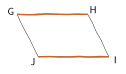
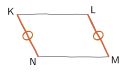
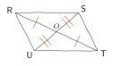
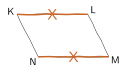
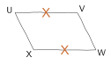
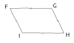
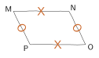


**Quadrilatères particuliers.** Le **parallélogramme** a ses côtés opposés parallèles. Il suffit, pour en reconnaître un, que l'une de ces conditions soit vérifiée :

- les diagonales se coupent en leur milieu ;
- les côtés opposés sont deux à deux de même longueur ;
- deux côtés opposés sont à la fois parallèles et de même longueur ;
- les angles opposés sont deux à deux de même mesure.

Le **losange** est un parallélogramme à quatre côtés égaux, le **rectangle** un parallélogramme à quatre angles droits, le **carré** les deux à la fois.

**Somme des angles d'un triangle.** Elle vaut toujours $180^\circ$. Dans un triangle **isocèle**, les deux angles à la base sont égaux ; dans un triangle **équilatéral**, les trois angles valent $60^\circ$.



---INTRO---
Qui est-ce ?
---Q---
Comment s'appelle un quadrilatère qui a quatre angles droits ?
---CORR---
C'est un ${\color{#EB7F73}\boldsymbol{rectangle}}$.
---Q---
Comment s'appelle un polygone qui a trois côtés ?
---CORR---
C'est un ${\color{#EB7F73}\boldsymbol{triangle}}$.
---Q---
Comment s'appelle un triangle qui a deux côtés de la même longueur ?
---CORR---
C'est un ${\color{#EB7F73}\boldsymbol{triangle isocèle}}$.
---Q---
Comment s'appelle un triangle qui a trois côtés de la même longueur ?
---CORR---
C'est un ${\color{#EB7F73}\boldsymbol{triangle équilatéral}}$.
---Q---
Comment s'appelle un quadrilatère qui a quatre côtés de la même longueur et quatre angles droits ?
---CORR---
C'est un ${\color{#EB7F73}\boldsymbol{carré}}$.
---Q---
Comment s'appelle un triangle qui possède un angle droit ?
---CORR---
C'est un ${\color{#EB7F73}\boldsymbol{triangle rectangle}}$.
---Q---
Comment s'appelle un polygone qui a quatre côtés ?
---CORR---
C'est un ${\color{#EB7F73}\boldsymbol{quadrilatère}}$.
---Q---
Comment s'appelle un quadrilatère qui a quatre côtés de la même longueur ?
---CORR---
C'est un ${\color{#EB7F73}\boldsymbol{losange}}$.



---INTRO---
Qui est-ce ?
---Q---
Quelle est la nature d'un quadrilatère ayant ses diagonales perpendiculaires et sécantes en leur milieu ?
---CORR---
Des diagonales qui se coupent en leur milieu donnent un parallélogramme ; perpendiculaires, elles en font un losange. C'est un ${\color{#EB7F73}\boldsymbol{losange}}$.
---Q---
Quelle est la nature d'un quadrilatère ayant ses 4 côtés de même longueur et 4 angles droits ?
---CORR---
C'est un ${\color{#EB7F73}\boldsymbol{carré}}$.
---Q---
Quelle est la nature d'un quadrilatère ayant ses diagonales de même longueur et sécantes en leur milieu ?
---CORR---
Des diagonales qui se coupent en leur milieu donnent un parallélogramme ; de même longueur, elles en font un rectangle. C'est un ${\color{#EB7F73}\boldsymbol{rectangle}}$.
---Q---
Quelle est la nature d'un quadrilatère ayant 4 côtés de même longueur ?
---CORR---
C'est un ${\color{#EB7F73}\boldsymbol{losange}}$.
---Q---
Quelle est la nature d'un quadrilatère ayant ses 4 côtés de même longueur et un angle droit ?
---CORR---
Quatre côtés de même longueur en font un losange ; un angle droit en fait un carré. C'est un ${\color{#EB7F73}\boldsymbol{carré}}$.
---Q---
Quelle est la nature d'un quadrilatère ayant 4 angles droits ?
---CORR---
C'est un ${\color{#EB7F73}\boldsymbol{rectangle}}$.
---Q---
Quelle est la nature d'un quadrilatère ayant ses diagonales perpendiculaires, de même longueur et sécantes en leur milieu ?
---CORR---
Les diagonales se coupent en leur milieu et sont de même longueur : c'est un rectangle ; perpendiculaires, elles en font un carré. C'est un ${\color{#EB7F73}\boldsymbol{carré}}$.
---Q---
Quelle est la nature d'un quadrilatère ayant 3 angles droits ?
---CORR---
Si trois angles sont droits, le quatrième l'est aussi car la somme des angles d'un quadrilatère vaut $360^\circ$. C'est un ${\color{#EB7F73}\boldsymbol{rectangle}}$.



---INTRO---
Pour chacune des figures suivantes, tracées à main levée, préciser s'il s'agit d'un parallélogramme.
---Q---

---CORR---
Les angles opposés sont codés deux à deux de la même mesure : $\widehat{V} = \widehat{X}$ et $\widehat{W} = \widehat{Y}$. ${\color{#EB7F73}\boldsymbol{C'est un parallélogramme.}}$
---Q---
  $(GH) // (IJ)$
---CORR---
On sait seulement que $(GH)$ et $(IJ)$ sont parallèles. Rien n'indique qu'elles ont la même longueur : ce pourrait être un simple trapèze. ${\color{#EB7F73}\boldsymbol{On ne peut pas conclure.}}$
---Q---
  $(LM) // (KN)$
---CORR---
$(LM)$ et $(KN)$ sont parallèles, et le codage indique qu'elles ont la même longueur. ${\color{#EB7F73}\boldsymbol{C'est un parallélogramme.}}$
---Q---

---CORR---
Le codage montre que les diagonales se coupent en leur milieu. ${\color{#EB7F73}\boldsymbol{C'est un parallélogramme.}}$
---Q---
  $(KL) // (MN)$
---CORR---
$(KL)$ et $(MN)$ sont parallèles, et le codage indique qu'elles ont la même longueur. ${\color{#EB7F73}\boldsymbol{C'est un parallélogramme.}}$
---Q---

---CORR---
Deux côtés opposés sont codés de la même longueur, mais rien n'indique qu'ils sont parallèles. ${\color{#EB7F73}\boldsymbol{On ne peut pas conclure.}}$
---Q---

---CORR---
Ce sont des côtés **consécutifs** qui sont codés égaux deux à deux, pas des côtés opposés : c'est un cerf-volant. ${\color{#EB7F73}\boldsymbol{On ne peut pas conclure.}}$
---Q---

---CORR---
Les côtés opposés sont codés deux à deux de la même longueur. ${\color{#EB7F73}\boldsymbol{C'est un parallélogramme.}}$



---INTRO---

---Q---
$UMW$ est un triangle quelconque. L'angle $\widehat{UMW}$ mesure $38^\circ$ et l'angle $\widehat{MUW}$ mesure $24^\circ$. Quelle est la mesure de l'angle $\widehat{MWU}$ ?
---CORR---
$$\begin{aligned}\widehat{MWU} &= 180^\circ - 38^\circ - 24^\circ \\ &= 180^\circ - 62^\circ \\ &= {\color{#EB7F73}\boldsymbol{118^\circ}}\end{aligned}$$
---Q---
$GQC$ est un triangle rectangle en $Q$ et l'angle $\widehat{QGC}$ mesure $61^\circ$. Quelle est la mesure de l'angle $\widehat{QCG}$ ?
---CORR---
Dans un triangle rectangle, les deux angles aigus sont complémentaires. $$\begin{aligned}\widehat{QCG} &= 90^\circ - 61^\circ \\ &= {\color{#EB7F73}\boldsymbol{29^\circ}}\end{aligned}$$
---Q---
$CJX$ est un triangle isocèle en $X$. L'angle $\widehat{CJX}$ mesure $41^\circ$. Quelle est la mesure de l'angle $\widehat{JXC}$ ?
---CORR---
Le triangle est isocèle en $X$ : les angles à la base $\widehat{CJX}$ et $\widehat{JCX}$ sont égaux, et valent chacun $41^\circ$. $$\begin{aligned}\widehat{JXC} &= 180^\circ - 2 \times 41^\circ \\ &= 180^\circ - 82^\circ \\ &= {\color{#EB7F73}\boldsymbol{98^\circ}}\end{aligned}$$
---Q---
$MLD$ est un triangle rectangle en $M$ et $\widehat{MDL}=\widehat{MLD}$. Quelle est la mesure de l'angle $\widehat{MDL}$ ?
---CORR---
Le triangle est rectangle en $M$, donc $\widehat{MDL} + \widehat{MLD} = 90^\circ$. Comme les deux angles sont égaux, chacun vaut la moitié. $$\begin{aligned}\widehat{MDL} &= \dfrac{90^\circ}{2} \\ &= {\color{#EB7F73}\boldsymbol{45^\circ}}\end{aligned}$$
---Q---
$LAV$ est un triangle dont les trois angles sont égaux. Quelle est la mesure de chacun de ces angles ?
---CORR---
Les trois angles sont égaux et leur somme vaut $180^\circ$. $$\begin{aligned}\text{chaque angle} &= \dfrac{180^\circ}{3} \\ &= {\color{#EB7F73}\boldsymbol{60^\circ}}\end{aligned}$$
---Q---
$UEP$ est un triangle rectangle en $U$. L'angle $\widehat{UEP}$ mesure le double de l'angle $\widehat{UPE}$. Quelles sont les mesures respectives des angles $\widehat{UPE}$ et $\widehat{UEP}$ ?
---CORR---
Le triangle est rectangle en $U$, donc $\widehat{UPE} + \widehat{UEP} = 90^\circ$. Notons $x$ la mesure de $\widehat{UPE}$ ; alors $\widehat{UEP} = 2x$. $$\begin{aligned}x + 2x &= 90^\circ \\ 3x &= 90^\circ \\ x &= \dfrac{90^\circ}{3}\end{aligned}$$Donc $\widehat{UPE} = {\color{#EB7F73}\boldsymbol{30^\circ}}$ et $\widehat{UEP} = {\color{#EB7F73}\boldsymbol{60^\circ}}$.
---Q---
$UVH$ est un triangle rectangle en $U$. L'angle $\widehat{UVH}$ mesure le quart de l'angle $\widehat{UHV}$. Quelles sont les mesures respectives des angles $\widehat{UVH}$ et $\widehat{UHV}$ ?
---CORR---
Le triangle est rectangle en $U$, donc $\widehat{UVH} + \widehat{UHV} = 90^\circ$. Notons $x$ la mesure de $\widehat{UVH}$ ; alors $\widehat{UHV} = 4x$. $$\begin{aligned}x + 4x &= 90^\circ \\ 5x &= 90^\circ \\ x &= \dfrac{90^\circ}{5}\end{aligned}$$Donc $\widehat{UVH} = {\color{#EB7F73}\boldsymbol{18^\circ}}$ et $\widehat{UHV} = {\color{#EB7F73}\boldsymbol{72^\circ}}$.
---Q---
$IRS$ est un triangle rectangle en $I$. L'angle $\widehat{IRS}$ est cinq fois plus grand que l'angle $\widehat{ISR}$. Quelles sont les mesures respectives des angles $\widehat{IRS}$ et $\widehat{ISR}$ ?
---CORR---
Le triangle est rectangle en $I$, donc $\widehat{ISR} + \widehat{IRS} = 90^\circ$. Notons $x$ la mesure de $\widehat{ISR}$ ; alors $\widehat{IRS} = 5x$. $$\begin{aligned}x + 5x &= 90^\circ \\ 6x &= 90^\circ \\ x &= \dfrac{90^\circ}{6}\end{aligned}$$Donc $\widehat{ISR} = {\color{#EB7F73}\boldsymbol{15^\circ}}$ et $\widehat{IRS} = {\color{#EB7F73}\boldsymbol{75^\circ}}$.
---Q---
$AWG$ est un triangle rectangle en $A$. L'angle $\widehat{AWG}$ mesure le tiers de l'angle $\widehat{AGW}$. Quelles sont les mesures respectives des angles $\widehat{AWG}$ et $\widehat{AGW}$ ?
---CORR---
Le triangle est rectangle en $A$, donc $\widehat{AWG} + \widehat{AGW} = 90^\circ$. Notons $x$ la mesure de $\widehat{AWG}$ ; alors $\widehat{AGW} = 3x$. $$\begin{aligned}x + 3x &= 90^\circ \\ 4x &= 90^\circ \\ x &= \dfrac{90^\circ}{4}\end{aligned}$$Donc $\widehat{AWG} = {\color{#EB7F73}\boldsymbol{22{,}5^\circ}}$ et $\widehat{AGW} = {\color{#EB7F73}\boldsymbol{67{,}5^\circ}}$.
---Q---
$PFK$ est un triangle isocèle en $P$. L'angle $\widehat{FPK}$ mesure les deux tiers de l'angle $\widehat{PFK}$. Quelles sont les mesures respectives des angles $\widehat{PFK}$, $\widehat{FPK}$ et $\widehat{PKF}$ ?
---CORR---
Le triangle est isocèle en $P$, et $\widehat{FPK} = \dfrac{2}{3}\widehat{PFK}$. Les deux angles à la base sont égaux, notons-les $x$.$$\begin{aligned}2x + \dfrac{2}{3}x &= 180^\circ \\ \dfrac{8}{3}x &= 180^\circ \\ x &= 67{,}5^\circ\end{aligned}$$Donc $\widehat{PFK} = {\color{#EB7F73}\boldsymbol{67{,}5^\circ}}$, $\widehat{PKF} = {\color{#EB7F73}\boldsymbol{67{,}5^\circ}}$ et $\widehat{FPK} = {\color{#EB7F73}\boldsymbol{45^\circ}}$.
---Q---
$OXD$ est un triangle isocèle en $O$. L'angle $\widehat{OXD}$ mesure le double de l'angle $\widehat{XOD}$. Quelles sont les mesures respectives des angles $\widehat{OXD}$, $\widehat{ODX}$ et $\widehat{XOD}$ ?
---CORR---
Le triangle est isocèle en $O$, et $\widehat{OXD} = 2\widehat{XOD}$, donc $\widehat{XOD} = \dfrac{1}{2}\widehat{OXD}$. Les deux angles à la base sont égaux, notons-les $x$.$$\begin{aligned}2x + \dfrac{1}{2}x &= 180^\circ \\ \dfrac{5}{2}x &= 180^\circ \\ x &= 72^\circ\end{aligned}$$Donc $\widehat{OXD} = {\color{#EB7F73}\boldsymbol{72^\circ}}$, $\widehat{ODX} = {\color{#EB7F73}\boldsymbol{72^\circ}}$ et $\widehat{XOD} = {\color{#EB7F73}\boldsymbol{36^\circ}}$.
---Q---
$HBL$ est un triangle isocèle en $B$. L'angle $\widehat{HBL}$ mesure $80^\circ$. Quelle est la mesure de l'angle $\widehat{BLH}$ ?
---CORR---
Le triangle est isocèle : les deux angles à la base sont égaux. $$\begin{aligned}\widehat{BLH} &= \dfrac{180^\circ - 80^\circ}{2} \\ &= \dfrac{100^\circ}{2} \\ &= {\color{#EB7F73}\boldsymbol{50^\circ}}\end{aligned}$$
---Q---
$LPF$ est un triangle isocèle en $L$. L'angle $\widehat{LPF}$ mesure le double de l'angle $\widehat{PLF}$. Quelles sont les mesures respectives des angles $\widehat{LPF}$, $\widehat{LFP}$ et $\widehat{PLF}$ ?
---CORR---
Le triangle est isocèle en $L$, et $\widehat{LPF} = 2\widehat{PLF}$, donc $\widehat{PLF} = \dfrac{1}{2}\widehat{LPF}$. Les deux angles à la base sont égaux, notons-les $x$.$$\begin{aligned}2x + \dfrac{1}{2}x &= 180^\circ \\ \dfrac{5}{2}x &= 180^\circ \\ x &= 72^\circ\end{aligned}$$Donc $\widehat{LPF} = {\color{#EB7F73}\boldsymbol{72^\circ}}$, $\widehat{LFP} = {\color{#EB7F73}\boldsymbol{72^\circ}}$ et $\widehat{PLF} = {\color{#EB7F73}\boldsymbol{36^\circ}}$.
---Q---
$BTD$ est un triangle quelconque. L'angle $\widehat{BTD}$ mesure $39^\circ$ et l'angle $\widehat{TBD}$ mesure $112^\circ$. Quelle est la mesure de l'angle $\widehat{TDB}$ ?
---CORR---
$$\begin{aligned}\widehat{TDB} &= 180^\circ - 39^\circ - 112^\circ \\ &= 180^\circ - 151^\circ \\ &= {\color{#EB7F73}\boldsymbol{29^\circ}}\end{aligned}$$


