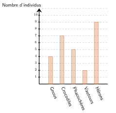


**Moyenne.** On additionne toutes les valeurs et on divise par leur nombre.

$$\text{moyenne} = \dfrac{\text{somme des valeurs}}{\text{nombre de valeurs}}$$

Avec des effectifs, on pondère : $\dfrac{n_1 x_1 + n_2 x_2 + \dots}{n_1 + n_2 + \dots}$.

**Médiane.** On range les valeurs dans l'ordre croissant. Si l'effectif $N$ est impair, la médiane est la valeur de rang $\dfrac{N+1}{2}$. S'il est pair, c'est la moyenne des valeurs de rangs $\dfrac{N}{2}$ et $\dfrac{N}{2}+1$.

**Fréquence.** $\dfrac{\text{effectif}}{\text{effectif total}}$, souvent donnée en pourcentage.



---INTRO---
Dans le parc naturel de Kinecardine, il y a des animaux. Certains sont des quadrupèdes (gnous, crocodiles, phacochères), et d'autres sont des oiseaux (vautours, hérons). Voici un diagramme en barres qui donne le nombre d'individus pour chaque espèce.  <strong>a.</strong> Quel est l'effectif des gnous ? <strong>b.</strong> Calculer la fréquence des crocodiles. Donner le résultat sous la forme d'un pourcentage arrondi, si besoin, à 0,1$\%$ près. <strong>c.</strong> Calculer l'effectif des quadrupèdes. <strong>d.</strong> Calculer la fréquence des oiseaux. Donner le résultat sous la forme d'un pourcentage arrondi, si besoin, à 0,1$\%$ près.
---Q---

---CORR---
**a.** On lit la hauteur de la barre des gnous : ${\color{#EB7F73}\boldsymbol{4}}$.  **b.** $\dfrac{7}{27} \approx 0{,}259$, soit ${\color{#EB7F73}\boldsymbol{25{,}9~\%}}$.  **c.** Les quadrupèdes sont les gnous, les crocodiles et les phacochères : $4+7+5 = {\color{#EB7F73}\boldsymbol{16}}$.  **d.** Les oiseaux sont les vautours et les hérons, soit $2+9 = 11$ individus. $\dfrac{11}{27} \approx 0{,}407$, soit ${\color{#EB7F73}\boldsymbol{40{,}7~\%}}$.



---INTRO---
$2$    ;    $11$    ;    $10$   ;    $29$ Quelle est la moyenne de cette série ?
---Q---

---CORR---
La somme des 4 valeurs vaut $52$. $\dfrac{52}{4} = 13$ La moyenne est ${\color{#EB7F73}\boldsymbol{13}}$.



---INTRO---
Calculer la moyenne des nombres : $\,\,\,\,\,\,\,\,8{,}9\,\,\,\,\,\,\,\,33{,}8\,\,\,\,\,\,\,\,2{,}3$
---Q---

---CORR---
La somme des 3 valeurs vaut $45$. $\dfrac{45}{3} = 15$ La moyenne est ${\color{#EB7F73}\boldsymbol{15}}$.



---INTRO---
La moyenne de la série de nombres suivante est $9$. $4$         $5$         $a$ Quelle est la valeur de $a$ ?
---Q---

---CORR---
La somme des trois nombres vaut $3 \times 9 = 27$. Donc $a = 27 - 4 - 5 = {\color{#EB7F73}\boldsymbol{18}}$.



---INTRO---
La moyenne de $-7$ et $a$ est $-1$. Quelle est la valeur de $a$ ?
---Q---

---CORR---
La somme des deux nombres vaut $2 \times (-1) = -2$. Donc $a = -2 - (-7) = -2 + 7 = {\color{#EB7F73}\boldsymbol{5}}$.



---INTRO---
Une série statistique de $27$ données est rangée dans l'ordre croissant. Quel est le rang de la médiane ?
---Q---

---CORR---
$27$ est impair, la médiane est la valeur de rang $\dfrac{27+1}{2} = 14$. C'est le rang ${\color{#EB7F73}\boldsymbol{14}}$.



---INTRO---
On donne la série statistique suivante :  7 ; 4 ; 12 ; 10 ; 17 ; 16 ; 15 ; 6 ; 2 Quelle est la médiane de la série ?
---Q---

---CORR---
On range les 9 valeurs dans l'ordre croissant. La médiane est le rang $5$. La médiane est ${\color{#EB7F73}\boldsymbol{10}}$.



---INTRO---
Lisa a obtenu ces notes ce trimestre-ci en mathématiques : $13$; $7$ ; $18$ ; $11$ ; $8$ ; $9$ ; $20$ ; $8$ ; $10$ ; $19$ et $18$. <strong>a.</strong> Calculer la moyenne de ces notes arrondie au dixième. <strong>b.</strong> Calculer la médiane de ces notes.
---Q---

---CORR---
**a.** La somme des 11 valeurs vaut $141$. $\dfrac{141}{11} = 12{,}818\ldots$ La moyenne est $\approx {\color{#EB7F73}\boldsymbol{12{,}8}}$.  **b.** On range les 11 valeurs dans l'ordre croissant. La médiane est le rang $6$. La médiane est ${\color{#EB7F73}\boldsymbol{11}}$.



---INTRO---
En septembre 2003, à Moscou, on a relevé les températures suivantes :  <table class="livret-tab"><tbody><tr><td>Jour</td><td>1</td><td>2</td><td>3</td><td>4</td><td>5</td><td>6</td><td>7</td><td>8</td><td>9</td><td>10</td><td>11</td><td>12</td><td>13</td><td>14</td><td>15</td></tr><tr><td>$\text{Température en} ^\circ\text{C}$</td><td>22</td><td>20</td><td>20</td><td>20</td><td>22</td><td>21</td><td>22</td><td>24</td><td>22</td><td>20</td><td>21</td><td>21</td><td>19</td><td>21</td><td>19</td></tr></tbody></table> <table class="livret-tab"><tbody><tr><td>Jour</td><td>16</td><td>17</td><td>18</td><td>19</td><td>20</td><td>21</td><td>22</td><td>23</td><td>24</td><td>25</td><td>26</td><td>27</td><td>28</td><td>29</td><td>30</td></tr><tr><td>$\text{Température en} ^\circ\text{C}$</td><td>19</td><td>21</td><td>20</td><td>22</td><td>20</td><td>22</td><td>22</td><td>24</td><td>23</td><td>22</td><td>23</td><td>24</td><td>23</td><td>25</td><td>25</td></tr></tbody></table> <strong>a.</strong> Calculer la moyenne des températures arrondie au dixième. <strong>b.</strong> Calculer la médiane des températures.
---Q---

---CORR---
**a.** La somme des 30 valeurs vaut $646$. $\dfrac{646}{30} = 21{,}533\ldots$ La moyenne est $\approx {\color{#EB7F73}\boldsymbol{21{,}5~^\circ\text{C}}}$.  **b.** On range les 30 valeurs dans l'ordre croissant. La médiane est la moyenne des rangs $15$ et $16$. La médiane est ${\color{#EB7F73}\boldsymbol{22~^\circ\text{C}}}$.



---INTRO---
La grille des salaires des employés d'une PME est donnée par le tableau ci-dessous : <table class="livret-tab"><tbody><tr><td>Catégories</td><td>Ouvrier</td><td>Ouvrier qualifié</td><td>Cadre</td><td>Cadre supérieur</td><td>Dirigeant</td></tr><tr><td>Salaires en €</td><td>1320</td><td>1500</td><td>1740</td><td>3530</td><td>8300</td></tr><tr><td>Effectif</td><td>22</td><td>17</td><td>15</td><td>31</td><td>1</td></tr></tbody></table> <strong>a.</strong> Calculer le salaire médian. <strong>b.</strong> Calculer le salaire moyen arrondi au dixième.
---Q---

---CORR---
**a.** L'effectif total est $22+17+15+31+1 = 86$, un nombre pair : la médiane est la moyenne des salaires de rangs $43$ et $44$. Les rangs $1$ à $22$ valent $1\,320$, les rangs $23$ à $39$ valent $1\,500$, les rangs $40$ à $54$ valent $1\,740$. Les rangs $43$ et $44$ valent donc tous deux $1\,740$ : le salaire médian est ${\color{#EB7F73}\boldsymbol{1\,740~€}}$.  **b.** $$\begin{aligned}\text{moyenne} &= \dfrac{1320\times 22 + 1500\times 17 + 1740\times 15 + 3530\times 31 + 8300\times 1}{22 + 17 + 15 + 31 + 1} \\ &= \dfrac{198\,370}{86} \\ &\approx {\color{#EB7F73}\boldsymbol{2306{,}6~€}}\end{aligned}$$



---INTRO---
Pour passer une commande de chaussures de foot, Madeleine a noté les pointures des membres de son club dans un tableau : <table class="livret-tab"><tbody><tr><td>Pointure</td><td>34</td><td>36</td><td>37</td><td>38</td><td>39</td><td>41</td><td>42</td></tr><tr><td>Effectif</td><td>7</td><td>2</td><td>7</td><td>3</td><td>7</td><td>2</td><td>2</td></tr></tbody></table> <strong>a.</strong> Calculer la médiane de ces pointures. <strong>b.</strong> Calculer la moyenne de ces pointures arrondie au dixième.
---Q---

---CORR---
**a.** L'effectif total est $7+2+7+3+7+2+2 = 30$, un nombre pair : la médiane est la moyenne des pointures de rangs $15$ et $16$. Les rangs $1$ à $7$ valent $34$, les rangs $8$ et $9$ valent $36$, les rangs $10$ à $16$ valent $37$. Les rangs $15$ et $16$ valent donc tous deux $37$ : la médiane est ${\color{#EB7F73}\boldsymbol{37}}$.  **b.** $$\begin{aligned}\text{moyenne} &= \dfrac{34\times 7 + 36\times 2 + 37\times 7 + 38\times 3 + 39\times 7 + 41\times 2 + 42\times 2}{7 + 2 + 7 + 3 + 7 + 2 + 2} \\ &= \dfrac{1\,122}{30} \\ &\approx {\color{#EB7F73}\boldsymbol{37{,}4}}\end{aligned}$$



---INTRO---
On a réalisé $99$ lancers d'un dé à $8$ faces. Les résultats sont inscrits dans le tableau ci-dessous : <table class="livret-tab"><tbody><tr><td>Scores</td><td>1</td><td>2</td><td>3</td><td>4</td><td>5</td><td>6</td><td>7</td><td>8</td></tr><tr><td>Nombre d'apparitions</td><td>18</td><td>13</td><td>10</td><td>8</td><td>10</td><td>17</td><td>12</td><td>11</td></tr></tbody></table> <strong>a.</strong> Calculer la moyenne des lancers arrondie au dixième. <strong>b.</strong> Calculer la médiane des lancers.
---Q---

---CORR---
**a.** $$\begin{aligned}\text{moyenne} &= \dfrac{1\times 18 + 2\times 13 + 3\times 10 + 4\times 8 + 5\times 10 + 6\times 17 + 7\times 12 + 8\times 11}{18 + 13 + 10 + 8 + 10 + 17 + 12 + 11} \\ &= \dfrac{430}{99} \\ &\approx {\color{#EB7F73}\boldsymbol{4{,}3}}\end{aligned}$$ **b.** L'effectif total est $99$, un nombre impair : la médiane est la valeur de rang $\dfrac{99+1}{2} = 50$. Les rangs $1$ à $18$ valent $1$, les rangs $19$ à $31$ valent $2$, les rangs $32$ à $41$ valent $3$, les rangs $42$ à $49$ valent $4$, les rangs $50$ à $59$ valent $5$. La médiane est ${\color{#EB7F73}\boldsymbol{5}}$.


