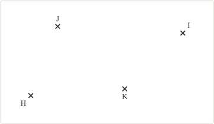
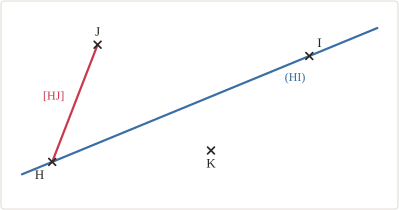
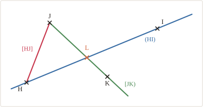
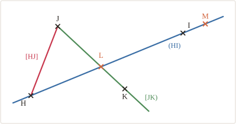




---Q---
Comment note-t-on la droite qui passe par les points $A$ et $B$ ?
---CORR---
${\color{#D36740}\boldsymbol{(AB)}}$ (ou $(BA)$)



---Q---
Les points $C$, $I$ et $G$ semblent-ils alignés ?
 

---CORR---
Ils semblent alignés, mais l'observation ne suffit pas à l'affirmer.



---Q---
Donner le triple de $25$ et le quart de $60$.
---CORR---
Triple de $25$ : ${\color{#D36740}\boldsymbol{75}}$ &emsp; Quart de $60$ : ${\color{#D36740}\boldsymbol{15}}$



---Q---
Sans poser l'opération, donner le dernier chiffre de $758 + 634$.
---CORR---
${\color{#D36740}\boldsymbol{2}}$



---Q---
Compléter : $7 \times \ldots = 56$
---CORR---
$7 \times {\color{#D36740}\boldsymbol{8}} = 56$







---Q---
Placer un point $D$ qui n'est pas aligné avec $C$ et $G$.
 

---CORR---
$D$ est placé en dehors de la droite $(CG)$.



---Q---
Que signifie « $C \in (d)$ » ?
---CORR---
Le point $C$ appartient à la droite $(d)$.



---Q---
Le double d'un nombre vaut $48$. Combien vaut son quart ?
---CORR---
${\color{#D36740}\boldsymbol{6}}$



---Q---
Écrire le nombre égal à $30$ dizaines et $14$ unités.
---CORR---
${\color{#D36740}\boldsymbol{314}}$



---Q---
Calculer mentalement : $500 - 137 = \ldots$
---CORR---
$500 - 137 = {\color{#D36740}\boldsymbol{363}}$







---Q---
Tracer la droite $(HI)$ en bleu, puis le segment $[HJ]$ en rouge.
 

---CORR---




---Q---
Tracer la demi-droite $[JK)$ en vert, puis placer $L$, point d'intersection de $(HI)$ et de $[JK)$.
 

---CORR---




---Q---
Placer un point $M$ tel que $M \notin [HI]$ et $M \in (HI)$.
 

---CORR---




