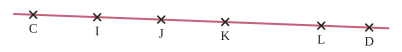




---Q---
Placer un point $N$ tel que $N \in (CG)$ et $N \notin [CG)$.
 

---CORR---
$N$ est sur la droite $(CG)$, de l'autre côté de $C$ par rapport à $G$.



---Q---
Compléter avec $\in$ ou $\notin$ en observant la figure.
 
$L \ldots [KD)$ &emsp; $C \ldots (ID)$ &emsp; $K \ldots [LD)$
 

---CORR---
$L {\color{#D36740}\boldsymbol{\in}} [KD)$ &emsp; $C {\color{#D36740}\boldsymbol{\in}} (ID)$ &emsp; $K {\color{#D36740}\boldsymbol{\notin}} [LD)$



---Q---
Compléter : $\ldots - 25 = 57$
---CORR---
${\color{#D36740}\boldsymbol{82}} - 25 = 57$



---Q---
Décomposer selon les rangs : $5\,208 = \ldots$
---CORR---
$5\,208 = {\color{#D36740}\boldsymbol{5 \times 1\,000 + 2 \times 100 + 8 \times 1}}$



---Q---
Sans poser l'opération, donner le dernier chiffre de $472 \times 165$.
---CORR---
${\color{#D36740}\boldsymbol{0}}$







---Q---
Dans le nombre $385{,}67$, quel est le chiffre des centièmes ?
---CORR---
${\color{#D36740}\boldsymbol{7}}$



---Q---
Compléter la suite logique : $0{,}42$ ; $0{,}52$ ; $0{,}62$ ; $\ldots$ ; $\ldots$
---CORR---
${\color{#D36740}\boldsymbol{0{,}72}}$ ; ${\color{#D36740}\boldsymbol{0{,}82}}$



---Q---
Placer le point $I$, milieu du segment $[CG]$.
 

---CORR---
$I$ est sur $[CG]$ avec $IC = IG$.



---Q---
Écrire $63\,150$ en lettres.
---CORR---
Soixante-trois-mille-cent-cinquante



---Q---
Combien manque-t-il à $640$ pour faire $1\,000$ ?
---CORR---
${\color{#D36740}\boldsymbol{360}}$







---Q---
Donner la partie entière puis la partie décimale de $68{,}24$.
---CORR---
Partie entière : ${\color{#D36740}\boldsymbol{68}}$ &emsp; Partie décimale : ${\color{#D36740}\boldsymbol{0{,}24}}$



---Q---
Compléter : $\dfrac{1}{10} = \dfrac{\ldots}{100}$
---CORR---
$\dfrac{1}{10} = \dfrac{{\color{#D36740}\boldsymbol{10}}}{100}$



---Q---
Écrire en chiffres : « soixante-douze-mille-quatre-cents ».
---CORR---
${\color{#D36740}\boldsymbol{72\,400}}$



---Q---
Parmi $(MN)$, $[MN]$ et $[MN)$, laquelle désigne le segment ? Et la demi-droite d'origine $M$ ?
---CORR---
Le segment : ${\color{#D36740}\boldsymbol{[MN]}}$ &emsp; La demi-droite d'origine $M$ : ${\color{#D36740}\boldsymbol{[MN)}}$



---Q---
Quelle est la moitié de $15$ ?
---CORR---
${\color{#D36740}\boldsymbol{7{,}5}}$



