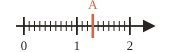




---Q---
Donner l'écriture décimale de : $6$ unités, $3$ dixièmes et $8$ centièmes.
---CORR---
${\color{#D36740}\boldsymbol{6{,}38}}$



---Q---
Compléter : $10 \times \dfrac{1}{100} = \ldots$
---CORR---
$10 \times \dfrac{1}{100} = {\color{#D36740}\boldsymbol{\dfrac{1}{10}}}$



---Q---
Dans $78\,543\,210$, quel est le chiffre des unités de millions ?
---CORR---
${\color{#D36740}\boldsymbol{8}}$



---Q---
Écrire, avec le symbole qui convient, que le point $D$ n'est pas sur la droite $(d)$.
---CORR---
${\color{#D36740}\boldsymbol{D \notin (d)}}$



---Q---
Dans quelles tables de multiplication (jusqu'à $10$) trouve-t-on $36$ ?
---CORR---
Tables de ${\color{#D36740}\boldsymbol{4}}$, ${\color{#D36740}\boldsymbol{6}}$ et ${\color{#D36740}\boldsymbol{9}}$







---Q---
Donner l'écriture décimale de $\dfrac{82}{10}$.
---CORR---
${\color{#D36740}\boldsymbol{8{,}2}}$



---Q---
Ranger dans l'ordre décroissant : $7{,}4$ ; $6{,}8$ ; $12$ ; $6{,}75$.
---CORR---
${\color{#D36740}\boldsymbol{12 \gt 7{,}4 \gt 6{,}8 \gt 6{,}75}}$



---Q---
Écrire en chiffres : « un milliard deux-cents-millions ».
---CORR---
${\color{#D36740}\boldsymbol{1\,200\,000\,000}}$



---Q---
Compléter : deux droites qui ne se coupent jamais sont $\ldots$ et on note $(d) \ldots (d')$.
---CORR---
Elles sont parallèles et on note $(d) {\color{#D36740}\boldsymbol{\mathbin{/\!/}}} (d')$.



---Q---
Donner le double de $47$ et la moitié de $62$.
---CORR---
Double de $47$ : ${\color{#D36740}\boldsymbol{94}}$ &emsp; Moitié de $62$ : ${\color{#D36740}\boldsymbol{31}}$







---Q---
Donner l'abscisse du point $A$.
 

---CORR---
${\color{#D36740}\boldsymbol{A\,(1{,}3)}}$



---Q---
Donner l'écriture décimale de $8 + \dfrac{5}{100} + \dfrac{2}{1000}$.
---CORR---
${\color{#D36740}\boldsymbol{8{,}052}}$



---Q---
Écrire $280$ en lettres.
---CORR---
Deux-cent-quatre-vingts



---Q---
Placer un point $M$ tel que $C \in [MG]$.
 

---CORR---
$M$ est placé de l'autre côté de $C$ par rapport à $G$.



---Q---
Donner le triple de $15$ et le quart de $84$.
---CORR---
Triple de $15$ : ${\color{#D36740}\boldsymbol{45}}$ &emsp; Quart de $84$ : ${\color{#D36740}\boldsymbol{21}}$



