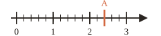




---Q---
Compléter : $2{,}6 = \dfrac{\ldots}{100}$
---CORR---
$2{,}6 = \dfrac{{\color{#D36740}\boldsymbol{260}}}{100}$



---Q---
Relier chaque fraction à son écriture décimale. 
$\dfrac{9}{10}$ &emsp; $\dfrac{9}{100}$ &emsp; $\dfrac{9}{1000}$  
$0{,}009$ &emsp; $0{,}9$ &emsp; $0{,}09$
---CORR---
$\dfrac{9}{10} = {\color{#D36740}\boldsymbol{0{,}9}}$ &emsp; $\dfrac{9}{100} = {\color{#D36740}\boldsymbol{0{,}09}}$ &emsp; $\dfrac{9}{1000} = {\color{#D36740}\boldsymbol{0{,}009}}$



---Q---
Que désigne la notation $AB$ ?
---CORR---
La longueur du segment $[AB]$, c'est-à-dire la distance entre $A$ et $B$.



---Q---
Écrire en chiffres :  
« six-mille-neuf-cent-quatre-vingts ».
---CORR---
${\color{#D36740}\boldsymbol{6\,980}}$



---Q---
Quel est le produit de $7$ par $6$ ?
---CORR---
$7 \times 6 = {\color{#D36740}\boldsymbol{42}}$







---Q---
Encadrer $74$ entre deux dizaines consécutives : $\ldots < 74 < \ldots$
---CORR---
${\color{#D36740}\boldsymbol{70}} < 74 < {\color{#D36740}\boldsymbol{80}}$



---Q---
Donner l'abscisse du point $A$.
 

---CORR---
${\color{#D36740}\boldsymbol{A\,(2{,}4)}}$



---Q---
Décomposer avec des fractions décimales : $6{,}28 = \ldots$
---CORR---
$6{,}28 = {\color{#D36740}\boldsymbol{6 + \dfrac{2}{10} + \dfrac{8}{100}}}$



---Q---
Écrire $320$ en lettres.
---CORR---
Trois-cent-vingt



---Q---
Calculer mentalement : $47 + 35 = \ldots$
---CORR---
$47 + 35 = {\color{#D36740}\boldsymbol{82}}$







---Q---
Donner l'écriture décimale de $15 + \dfrac{4}{10} + \dfrac{7}{100}$.
---CORR---
${\color{#D36740}\boldsymbol{15{,}47}}$



---Q---
Compléter : $\dfrac{10}{100} \times \ldots = 1$
---CORR---
$\dfrac{10}{100} \times {\color{#D36740}\boldsymbol{10}} = 1$



---Q---
Comparer : $8{,}3 \ldots 8{,}301$
---CORR---
$8{,}3 {\color{#D36740}\boldsymbol{\lt}} 8{,}301$



---Q---
Calculer mentalement : $1\,000 - 420 = \ldots$
---CORR---
$1\,000 - 420 = {\color{#D36740}\boldsymbol{580}}$



---Q---
Quel nombre est $4$ fois moins grand que $120$ ?
---CORR---
$120 \div 4 = {\color{#D36740}\boldsymbol{30}}$



