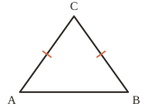
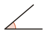
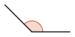
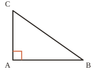




---Q---
Comment note-t-on l'angle de sommet $I$ dont les côtés passent par $C$ et $M$ ?
---CORR---
${\color{#D36740}\boldsymbol{\widehat{CIM}}}$ (ou $\widehat{MIC}$)



---Q---
Que signifie le codage porté sur la figure ?
 

---CORR---
$AC = BC$ : le triangle $ABC$ est isocèle en $C$.



---Q---
Compléter : $25{,}37 = 25 + \dfrac{\ldots}{100}$
---CORR---
$25{,}37 = 25 + \dfrac{{\color{#D36740}\boldsymbol{37}}}{100}$



---Q---
Dans le nombre $4\,738\,021$, quel est le chiffre des dizaines de mille ?
---CORR---
${\color{#D36740}\boldsymbol{3}}$



---Q---
Calculer :  
$9 \times 6 = \ldots$ &emsp; $4 \times 7 = \ldots$ &emsp; $8 \times 9 = \ldots$
---CORR---
$9 \times 6 = {\color{#D36740}\boldsymbol{54}}$ &emsp; $4 \times 7 = {\color{#D36740}\boldsymbol{28}}$ &emsp; $8 \times 9 = {\color{#D36740}\boldsymbol{72}}$







---Q---
Donner la nature de cet angle.
 

---CORR---
Angle aigu (plus petit qu'un angle droit).



---Q---
Sur une figure, comment code-t-on un angle droit ?
---CORR---
Par un petit carré au sommet de l'angle.



---Q---
Quel est le nombre entier de centaines dans $837$ ?
---CORR---
${\color{#D36740}\boldsymbol{8}}$ &emsp; car $837 = 8 \times 100 + 37$



---Q---
Décomposer avec des fractions décimales : $14{,}053 = \ldots$
---CORR---
$14{,}053 = {\color{#D36740}\boldsymbol{14 + \dfrac{5}{100} + \dfrac{3}{1000}}}$



---Q---
Compléter : $\ldots - 64 = 66$
---CORR---
${\color{#D36740}\boldsymbol{130}} - 64 = 66$







---Q---
Donner la nature de cet angle.
 

---CORR---
Angle obtus (plus grand qu'un angle droit, plus petit qu'un angle plat).



---Q---
Que signifie le codage porté sur la figure ?
 

---CORR---
Le triangle $ABC$ est rectangle en $A$.



---Q---
Compléter : $100 \times \dfrac{1}{1000} = \ldots$
---CORR---
$100 \times \dfrac{1}{1000} = {\color{#D36740}\boldsymbol{\dfrac{1}{10}}}$



---Q---
Quel est le tiers de $81$ ?
---CORR---
$81 \div 3 = {\color{#D36740}\boldsymbol{27}}$



---Q---
Donner le double de $29$ et la moitié de $58$.
---CORR---
Double de $29$ : ${\color{#D36740}\boldsymbol{58}}$ &emsp; Moitié de $58$ : ${\color{#D36740}\boldsymbol{29}}$



