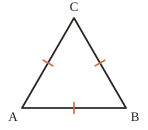
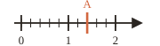




---Q---
Compléter : un angle de $137°$ est un angle $\ldots$
---CORR---
Un angle obtus (compris entre $90°$ et $180°$).



---Q---
Que signifie le codage porté sur la figure ?
 

---CORR---
$AB = BC = AC$ : le triangle $ABC$ est équilatéral.



---Q---
Donner l'abscisse du point $A$.
 

---CORR---
${\color{#D36740}\boldsymbol{A\,(1{,}4)}}$



---Q---
Compléter : deux droites qui se coupent en formant un angle droit sont $\ldots$ et on note $(d) \ldots (d')$.
---CORR---
Elles sont perpendiculaires et on note $(d) {\color{#D36740}\boldsymbol{\perp}} (d')$.



---Q---
Convertir : $7$ m $= \ldots$ mm
---CORR---
$7$ m $= {\color{#D36740}\boldsymbol{7\,000}}$ mm







---Q---
Écrire le produit de $12$ par $5$, puis le calculer.
---CORR---
$12 \times 5 = {\color{#D36740}\boldsymbol{60}}$



---Q---
Dans l'opération « $9 - 4$ », comment s'appellent les nombres $9$ et $4$ ?
---CORR---
Ce sont les termes de la différence.



---Q---
Vrai ou faux : une droite a un milieu.
---CORR---
Faux : une droite est illimitée, elle n'a ni longueur ni milieu.



---Q---
Compléter avec un nombre décimal : $28{,}99 < \ldots < 29$
---CORR---
Par exemple $28{,}99 < {\color{#D36740}\boldsymbol{28{,}995}} < 29$



---Q---
Combien manque-t-il à $250$ pour faire $1\,000$ ?
---CORR---
$1\,000 - 250 = {\color{#D36740}\boldsymbol{750}}$







---Q---
Calculer la somme de $24$ et $36$, puis la différence de $24$ et $12$.
---CORR---
Somme : $24 + 36 = {\color{#D36740}\boldsymbol{60}}$ &emsp; Différence : $24 - 12 = {\color{#D36740}\boldsymbol{12}}$



---Q---
Dans l'égalité « $6 + 3 = 9$ », comment s'appelle le nombre $9$ ?
---CORR---
C'est la somme.



---Q---
Deux angles adjacents mesurent $110°$ et $70°$. Que forment-ils ensemble ?
---CORR---
$110° + 70° = 180°$ : ils forment un angle plat.



---Q---
Sur une figure, que signifient deux petits traits identiques sur deux segments ?
---CORR---
Que ces deux segments ont la même longueur.



---Q---
Compléter : $7{,}409 = 7 + \dfrac{\ldots}{10} + \dfrac{\ldots}{1000}$
---CORR---
$7{,}409 = 7 + \dfrac{{\color{#D36740}\boldsymbol{4}}}{10} + \dfrac{{\color{#D36740}\boldsymbol{9}}}{1000}$



